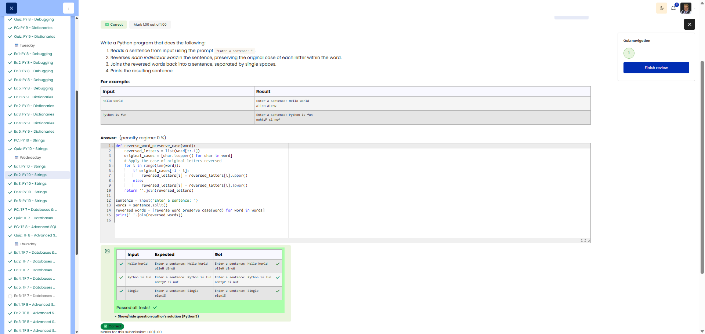

# 🐍 Reverse Words

**Course:** Cyber Security Analyst - Python Basics | **Date:** 3 July 2025

---

## Task

**Objective:** Reverse every word in a sentence, keeping the order of the words the same.

**Requirements:**
- Input: Sentence (with prompt)
- Processing: Reverse each word individually
- Output: Reversed words, separated by spaces

---

## Solution

```python
# Read in sentence
sentence = input("Enter a sentence: ")

# Split, reverse and rejoin the words
words = sentence.split()
reversed_words = [word[::-1] for word in words]
result = " ".join(reversed_words)

# Output
print(result)
```

**Concise alternative:**
```python
sentence = input("Enter a sentence: ")
print(" ".join(word[::-1] for word in sentence.split()))
```

---

## Evidence

The Cybersteps review shows the reverse-words solution marked correct. The visible tests confirm that each individual word is reversed while the word order and original letter casing positions are handled as required by the exercise.



---

## Tests
| Input | Output | ✓ |
|-------|--------|---|
| `Hello World` | `olleH dlroW` | ✅ |
| `Python is fun` | `nohtyP si nuf` | ✅ |
| `A` | `A` | ✅ |

---

## Notes

- **`[::-1]`:** Slice notation for reversing a string
- **`.split()`:** Splits string at spaces → list
- **`" ".join(list)`:** Joins list with spaces
- **List Comprehension:** `[expression for item in list]`


