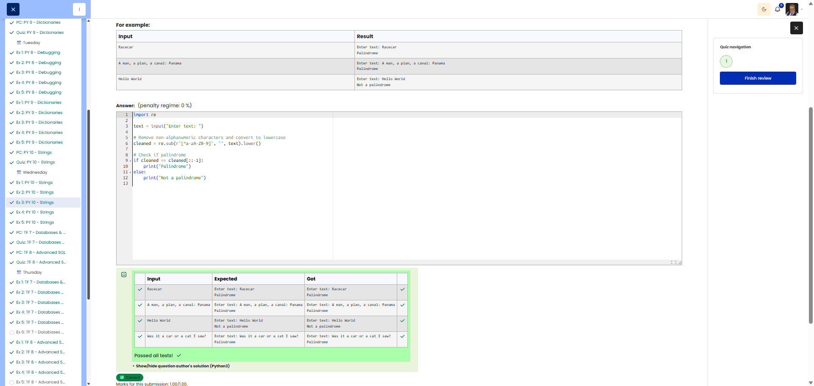

# 🐍 Palindrome Check

**Course:** Cyber Security Analyst - Python Basics | **Date:** 3 July 2025

---

## Task

**Objective:** Check whether a text is a palindrome (ignore case, spaces and special characters).

**Requirements:**
- Input: Text (with prompt)
- Processing: Alphanumeric characters only, case-insensitive
- Output: `"Palindrome"` or `"Not a palindrome"`

---

## Solution

```python
# Read text
text = input("Enter text: ")

# Only alphanumeric characters, lowercase
cleaned = ""
for char in text.lower():
    if char.isalnum():
        cleaned += char

# Palindrome check
if cleaned == cleaned[::-1]:
    print("Palindrome")
else:
    print("Not a palindrome")
```

**Compact alternative:**
```python
text = input("Enter text: ")
cleaned = "".join(c for c in text.lower() if c.isalnum())
print("Palindrome" if cleaned == cleaned[::-1] else "Not a palindrome")
```

---

## Evidence

The Cybersteps review shows the palindrome solution marked correct. The visible tests confirm that non-alphanumeric characters and case are ignored before comparing the cleaned text with its reverse.



---

## Tests
| Input | Output | ✓ |
|-------|--------|---|
| `Racecar` | `Palindrome` | ✅ |
| `A man, a plan, a canal: Panama` | `Palindrome` | ✅ |
| `Hello World` | `Not a palindrome` | ✅ |
| `Was it a car or a cat I saw?` | `Palindrome` | ✅ |

---

## Notes

- **`.isalnum()`:** `True` if a letter or digit
- **`.lower()`:** Converts to lower case
- **Palindrome:** Reads the same forwards and backwards
- **`[::-1]`:** Reverse the string


