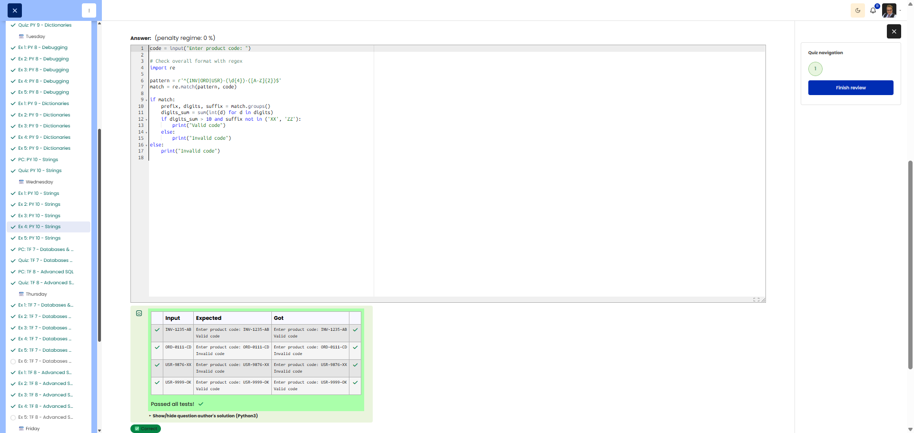

# 🐍 Product Code Validation - Check product code

**Course:** Cyber Security Analyst - Python Basics | **Date:** 3 July 2025

---

## Task

**Objective:** Validate product codes in the format `PREFIX-####-SUFFIX` using specific rules.

**Requirements:**
- Format: `PREFIX-####-SUFFIX`
- PREFIX: 3 letters, only `INV`, `ORD`, `USR`
- ####: 4 digits, sum > 10
- SUFFIX: 2 letters, not `XX` or `ZZ`

---

## Solution

```python
# Read in code
code = input("Enter product code: ")

# Validation
valid = False

# Check format: exactly 2 hyphens in the correct positions
parts = code.split("-")
if len(parts) == 3:
    prefix, digits, suffix = parts
    
    # Check all conditions
    if (prefix in ['INV', 'ORD', 'USR'] and      # Valid prefix
        len(digits) == 4 and                      # 4 characters
        digits.isdigit() and                      # Only digits
        sum(int(d) for d in digits) > 10 and     # Sum > 10
        len(suffix) == 2 and                      # 2 characters
        suffix.isalpha() and                      # Only letters
        suffix.isupper() and                      # Uppercase letters
        suffix not in ['XX', 'ZZ']):              # Not XX/ZZ
        valid = True

# Output
if valid:
    print("Valid code")
else:
    print("Invalid code")
```

---

## Evidence

The Cybersteps review shows the product-code validation solution marked correct. The visible tests confirm that the script validates the allowed prefixes, digit-sum rule, suffix restrictions, and overall code format.



---

## Tests
| Input | Output | Reason | ✓ |
|-------|--------|-------|---|
| `INV-1235-AB` | `Valid code` | All rules met (1+2+3+5=11>10) | ✅ |
| `ORD-0111-CD` | `Invalid code` | Sum 0+1+1+1=3 ≤ 10 | ✅ |
| `USR-9876-XX` | `Invalid code` | Suffix `XX` not allowed | ✅ |
| `ABC-1234-AB` | `Invalid code` | Prefix not allowed | ✅ |

---

## Notes

- **`.split("-")`:** Splits the string at hyphens
- **`.isdigit()`:** `True` if only digits
- **`.isalpha()`:** `True` if only letters
- **`.isupper()`:** `True` if all uppercase letters
- **`sum(int(d) for d in digits)`:** Calculate the sum of the digits


