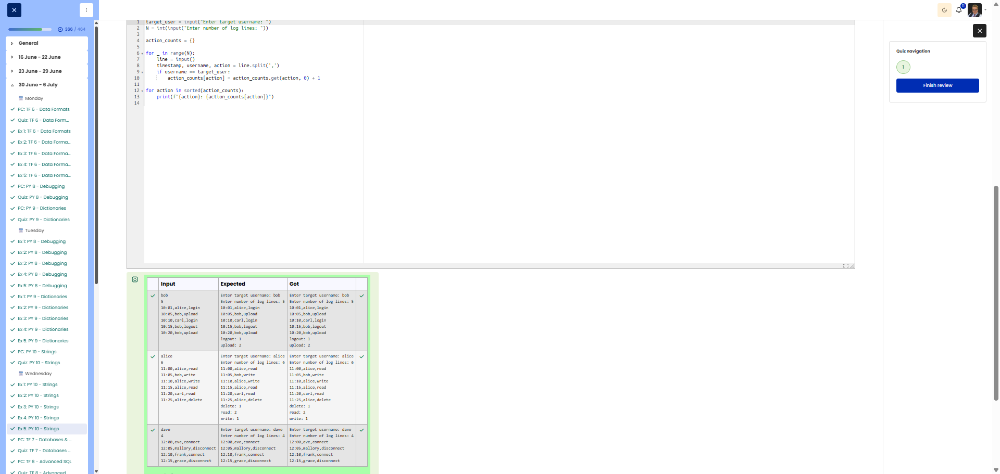

# 🐍 Log Processing - Analysing log entries

**Course:** Cyber Security Analyst - Python Basics | **Date:** 3 July 2025

---

## Task

**Objective:** Count the actions performed by a specific user from log entries.

**Requirements:**
- Input: Username, number of lines, log lines (`timestamp,username,action`)
- Processing: Filter by user, count actions
- Output: Actions sorted alphabetically with count

---

## Solution

```python
# Inputs
target_user = input("Enter target username: ")
n = int(input("Enter number of log lines: "))

# Count actions
action_counts = {}

for _ in range(n):
    line = input()
    timestamp, username, action = line.split(",")
    
    # Process target user only
    if username == target_user:
        if action in action_counts:
            action_counts[action] += 1
        else:
            action_counts[action] = 1

# Print sorted
for action in sorted(action_counts.keys()):
    print(f"{action}: {action_counts[action]}")
```

**Alternative using .get():**
```python
target_user = input("Enter target username: ")
n = int(input("Enter number of log lines: "))

action_counts = {}
for _ in range(n):
    parts = input().split(",")
    if parts[1] == target_user:
        action_counts[parts[2]] = action_counts.get(parts[2], 0) + 1

for action in sorted(action_counts):
    print(f"{action}: {action_counts[action]}")
```

---

## Evidence

The Cybersteps review shows the log-processing solution marked correct. The visible tests confirm that log entries are filtered by target user, actions are counted, and the output is sorted alphabetically by action name.



---

## Tests
| Input | Output | ✓ |
|-------|--------|---|
| User: `bob`, 5 lines with bob: upload(2), logout(1) | `logout: 1` `upload: 2` | ✅ |
| User: `alice`, 6 lines with alice: read(2), write(1), delete(1) | `delete: 1` `read: 2` `write: 1` | ✅ |

---

## Notes

- **`.split(",")`:** Splits log lines at commas
- **`for _ in range(n)`:** `_` when a variable is not needed
- **`sorted(dict.keys())`:** Sort keys alphabetically
- **Case-sensitive:** `"bob"` ≠ `"Bob"` (case-sensitive)


