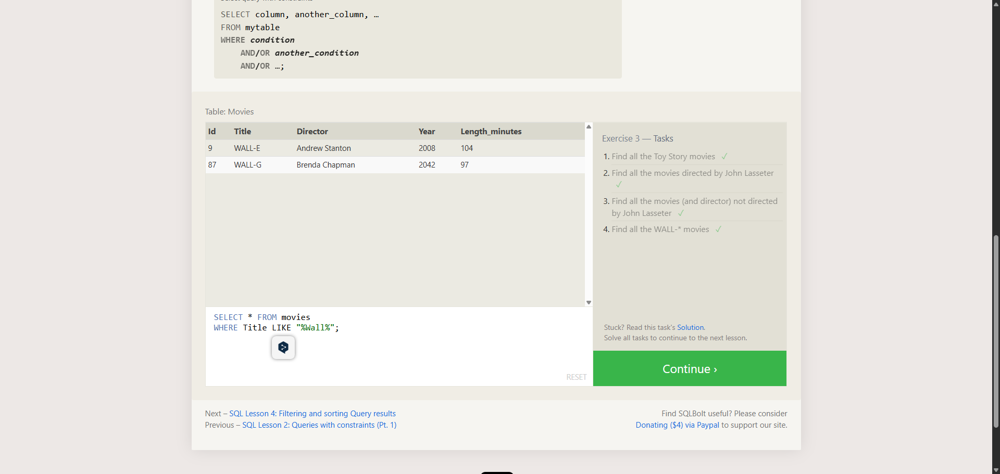

# TF 7 - Databases & SQL

## Summary
This file documents the completed Cybersteps task Ex 3: TF 7 - Databases & SQL. The task focused on basic SQL querying with SQLBolt.

## Approach
The task was completed in the browser-based SQLBolt environment. I used SQL clauses such as SELECT, WHERE, LIKE, ORDER BY, LIMIT, and OFFSET where required by the exercise.

## Result / Evidence
The screenshot shows SQLBolt Exercise 3. All four tasks are checked, and the visible query uses LIKE to find titles matching the Wall pattern.

Visible query:

```sql
SELECT * FROM movies
WHERE Title LIKE "%Wall%";
```



## Assessment
The evidence shows the completed SQLBolt exercise with all listed tasks checked. This indicates that the submitted queries produced the expected results for the course context.
