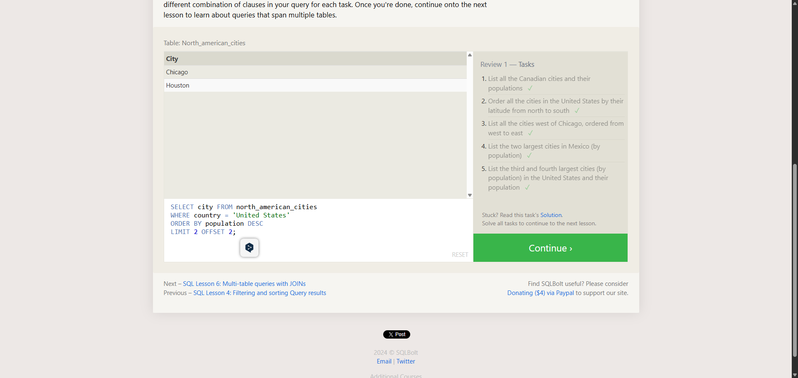

# TF 7 - Databases & SQL

## Summary
This file documents the completed Cybersteps task Ex 5: TF 7 - Databases & SQL. The task focused on basic SQL querying with SQLBolt.

## Approach
The task was completed in the browser-based SQLBolt environment. I used SQL clauses such as SELECT, WHERE, LIKE, ORDER BY, LIMIT, and OFFSET where required by the exercise.

## Result / Evidence
The screenshot shows SQLBolt Review 1. All five tasks are checked, and the visible query filters U.S. cities, sorts by population, and uses LIMIT/OFFSET for the third and fourth largest cities.

Visible query:

```sql
SELECT city FROM north_american_cities
WHERE country = 'United States'
ORDER BY population DESC
LIMIT 2 OFFSET 2;
```



## Assessment
The evidence shows the completed SQLBolt exercise with all listed tasks checked. This indicates that the submitted queries produced the expected results for the course context.
