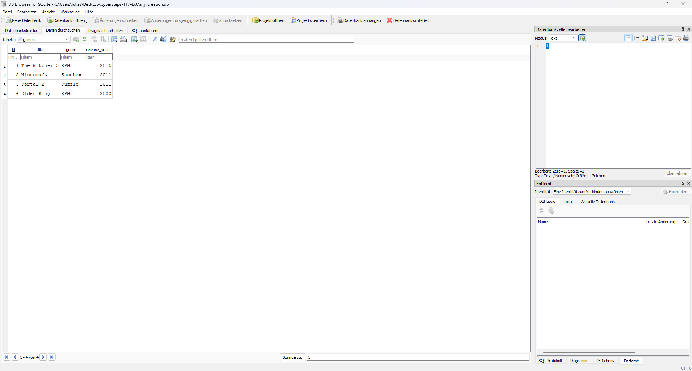

# Data Director - Creating an SQLite Database with Python

**Course:** Cyber Security Analyst - Technical Fundament Basics  
**Date:** 03 July 2025

---

## Task

The objective was to create an SQLite database with Python, define a table, insert records, and query the stored data.

---

## Solution

### Python Script (create_database.py)

```python
import sqlite3

conn = sqlite3.connect("my_creation.db")
cursor = conn.cursor()

cursor.execute("""
    CREATE TABLE IF NOT EXISTS games (
        id INTEGER PRIMARY KEY,
        title TEXT NOT NULL,
        genre TEXT,
        release_year INTEGER
    )
""")

games_data = [
    ("The Witcher 3", "RPG", 2015),
    ("Minecraft", "Sandbox", 2011),
    ("Portal 2", "Puzzle", 2011),
    ("Elden Ring", "RPG", 2022)
]

cursor.executemany("""
    INSERT INTO games (title, genre, release_year)
    VALUES (?, ?, ?)
""", games_data)

conn.commit()

cursor.execute("SELECT * FROM games")
results = cursor.fetchall()

print("All games in the database:")
print("-" * 40)
for row in results:
    print(f"ID: {row[0]}, Title: {row[1]}, Genre: {row[2]}, Year: {row[3]}")

conn.close()

print("\nDatabase successfully created: my_creation.db")
```

### Expected Console Output

```
All games in the database:
----------------------------------------
ID: 1, Title: The Witcher 3, Genre: RPG, Year: 2015
ID: 2, Title: Minecraft, Genre: Sandbox, Year: 2011
ID: 3, Title: Portal 2, Genre: Puzzle, Year: 2011
ID: 4, Title: Elden Ring, Genre: RPG, Year: 2022

Database successfully created: my_creation.db
```

---

## Evidence

The screenshot shows my_creation.db opened in DB Browser for SQLite. In the Browse Data view, the games table is selected and contains the columns id, 	itle, genre, and 
elease_year with four inserted records.



---

## Notes

- sqlite3.connect() creates or opens the database file.
- cursor.execute() runs individual SQL statements.
- cursor.executemany() inserts multiple records with placeholders.
- ? placeholders reduce SQL injection risk for dynamic values.
- conn.commit() persists the changes.
- SELECT * FROM games reads the stored records for verification.
