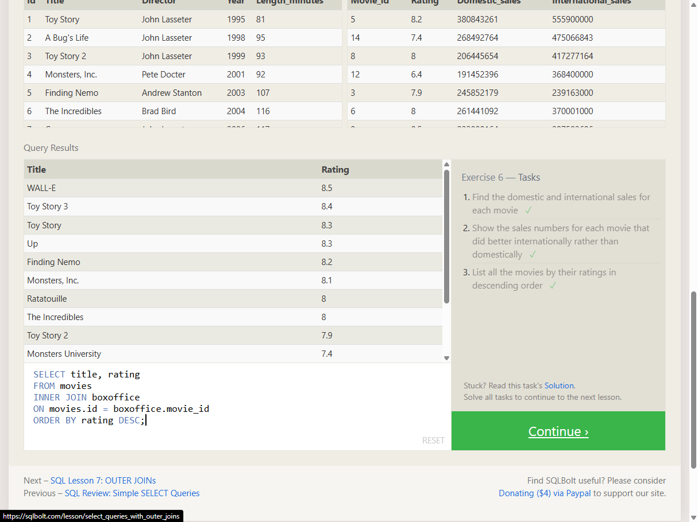

# TF-8 Advanced SQL - 1-Joining the Club

## Task

This exercise completed SQLBolt Lesson 6. The goal was to combine data from multiple tables with `INNER JOIN` and finish every task in the lesson successfully.

## Environment

- Browser: SQLBolt
- Lesson: SQLBolt Lesson 6 - Multi-table queries with JOINs
- Module 1: no TryHackMe

## Procedure

1. Opened SQLBolt Lesson 6 in the browser.
2. Read the explanation for `INNER JOIN`.
3. Solved the three query tasks in the lesson.
4. Verified that SQLBolt marked all three tasks as completed.

## Queries Used

### Task 1

```sql
SELECT title, domestic_sales, international_sales
FROM movies
INNER JOIN boxoffice
ON movies.id = boxoffice.movie_id;
```

### Task 2

```sql
SELECT title, domestic_sales, international_sales
FROM movies
INNER JOIN boxoffice
ON movies.id = boxoffice.movie_id
WHERE international_sales > domestic_sales;
```

### Task 3

```sql
SELECT title, rating
FROM movies
INNER JOIN boxoffice
ON movies.id = boxoffice.movie_id
ORDER BY rating DESC;
```

## Result

All three SQLBolt Lesson 6 tasks were completed successfully. The screenshot shows the query results and the task panel with all three checkmarks visible.



## Evidence Assessment

The screenshot is sufficient evidence because it shows SQLBolt Lesson 6 with all three tasks marked as solved. It also shows the final query used to list movies by rating in descending order.

## Security / Practice Relevance

`INNER JOIN` is a core SQL technique for connecting related data across tables. In security and analysis work, this is useful when combining users, assets, logs, findings, or other records through shared identifiers.