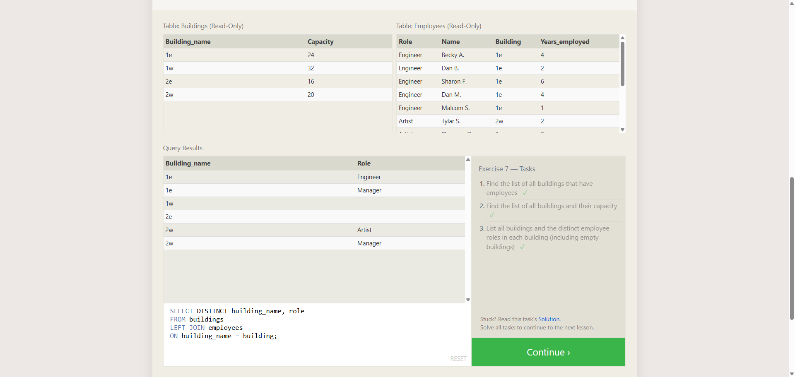

# TF-8 Advanced SQL - 2-Feeling Left Out

**Course:** Cyber Security Analyst - Technical Fundamentals  
**Category:** Advanced SQL  
**Sprint status:** Completed  
**Target / Scope:** SQLBolt Lesson 7 - OUTER JOINs  
**Date:** 25 July 2026

---

## Task

This exercise completed SQLBolt Lesson 7. The goal was to practice `OUTER JOIN`s, especially `LEFT JOIN`, so records remain visible even when the second table has no matching row.

---

## What I Did

1. Opened SQLBolt Lesson 7 in the browser.
2. Read the explanation for `LEFT JOIN`, `RIGHT JOIN`, and `FULL JOIN`.
3. Solved the three query tasks in the lesson.
4. Verified that SQLBolt marked all three tasks as completed.

---

## Queries Used

### Task 1

```sql
SELECT DISTINCT building
FROM employees;
```

### Task 2

```sql
SELECT *
FROM buildings;
```

### Task 3

```sql
SELECT DISTINCT building_name, role
FROM buildings
LEFT JOIN employees
ON building_name = building;
```

---

## Evidence



The screenshot shows SQLBolt Lesson 7 with the `Buildings` and `Employees` tables, the query results, and the final `LEFT JOIN` query. All three task checkmarks are visible on the right.

---

## Findings

| Finding | Evidence | Interpretation |
|---|---|---|
| Lesson 7 was completed | All three task checkmarks are visible | The SQLBolt tasks were accepted |
| `LEFT JOIN` was used | Query field shows `LEFT JOIN employees` | Buildings without matching employee rows remain visible |
| Empty building-role combinations appear | Rows for `1w` and `2e` have empty role values | This indicates unmatched rows from the left table |

---

## Security Relevance

`LEFT JOIN` is useful when missing relationships matter. In security work, this can reveal assets without owners, accounts without assignments, findings without tickets, or other records that would disappear in a plain `INNER JOIN`.

---

## Reviewer-Readable Result

| Field | Entry |
|---|---|
| Lab scope | SQLBolt Lesson 7 |
| Tool or method | Browser-based SQL exercise |
| Key observation | `LEFT JOIN` keeps buildings even when no employee is assigned |
| Final evidence | Screenshot with all three SQLBolt checkmarks |
| Security lesson | Missing relationships can be important evidence |
| Redactions | No credentials, cookies, tokens, or private data included |

---

## Short Explanation

This task shows the difference between matching rows only and keeping the full left-side table visible. With `LEFT JOIN`, buildings without assigned employees are still included in the result.