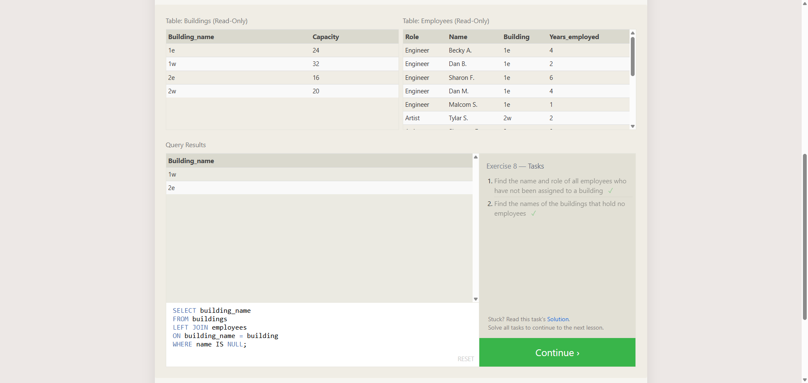

# TF-8 Advanced SQL - 3-Or Just... NULL

**Course:** Cyber Security Analyst - Technical Fundamentals  
**Category:** Advanced SQL  
**Sprint status:** Completed  
**Target / Scope:** SQLBolt Lesson 8 - A short note on NULLs  
**Date:** 25 July 2026

---

## Task

This exercise completed SQLBolt Lesson 8. The goal was to identify `NULL` values correctly and filter them with `IS NULL`.

---

## What I Did

1. Opened SQLBolt Lesson 8 in the browser.
2. Read the explanation for `NULL`, `IS NULL`, and `IS NOT NULL`.
3. Solved the two query tasks in the lesson.
4. Verified that SQLBolt marked both tasks as completed.

---

## Queries Used

### Task 1

```sql
SELECT name, role
FROM employees
WHERE building IS NULL;
```

### Task 2

```sql
SELECT building_name
FROM buildings
LEFT JOIN employees
ON building_name = building
WHERE name IS NULL;
```

---

## Evidence



The screenshot shows SQLBolt Lesson 8 with both task checkmarks visible. The query field shows the second query, using `LEFT JOIN` and `WHERE name IS NULL` to find buildings without employees.

---

## Findings

| Finding | Evidence | Interpretation |
|---|---|---|
| Lesson 8 was completed | Both task checkmarks are visible | The SQLBolt tasks were accepted |
| `IS NULL` was used correctly | Query field shows `WHERE name IS NULL` | Missing matches were filtered explicitly |
| Buildings without employees were identified | Query result shows `1w` and `2e` | These buildings have no matching employee rows |

---

## Security Relevance

`NULL` values matter in analysis because missing relationships can be meaningful evidence. Examples include assets without owners, users without roles, findings without tickets, or logs without correlation fields.

---

## Reviewer-Readable Result

| Field | Entry |
|---|---|
| Lab scope | SQLBolt Lesson 8 |
| Tool or method | Browser-based SQL exercise |
| Key observation | `IS NULL` identifies missing values and missing join matches |
| Final evidence | Screenshot with both SQLBolt checkmarks |
| Security lesson | Missing data can be meaningful evidence |
| Redactions | No credentials, cookies, tokens, or private data included |

---

## Short Explanation

This task shows that missing values in SQL are checked with `IS NULL`, not `= NULL`. Combined with `LEFT JOIN`, this makes missing relationships visible.