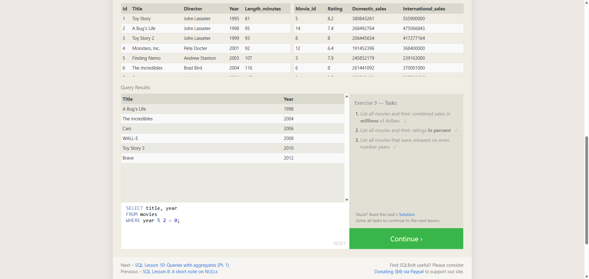

# TF-8 Advanced SQL - 4-Express Yourself

**Course:** Cyber Security Analyst - Technical Fundamentals  
**Category:** Advanced SQL  
**Sprint status:** Completed  
**Target / Scope:** SQLBolt Lesson 9 - Queries with expressions  
**Date:** 25 July 2026

---

## Task

This exercise completed SQLBolt Lesson 9. The goal was to use SQL expressions directly in `SELECT` queries, for example for calculations and filtering logic.

---

## What I Did

1. Opened SQLBolt Lesson 9 in the browser.
2. Read the explanation for calculated columns and aliases.
3. Solved the three query tasks in the lesson.
4. Verified that SQLBolt marked all three tasks as completed.

---

## Queries Used

### Task 1

```sql
SELECT title, (domestic_sales + international_sales) / 1000000 AS gross_sales_millions
FROM movies
JOIN boxoffice
ON movies.id = boxoffice.movie_id;
```

### Task 2

```sql
SELECT title, rating * 10 AS rating_percent
FROM movies
JOIN boxoffice
ON movies.id = boxoffice.movie_id;
```

### Task 3

```sql
SELECT title, year
FROM movies
WHERE year % 2 = 0;
```

---

## Evidence



The screenshot shows SQLBolt Lesson 9 with all three task checkmarks visible. The query field shows the third query, using the modulo expression `year % 2 = 0` to filter movies released in even-numbered years.

---

## Findings

| Finding | Evidence | Interpretation |
|---|---|---|
| Lesson 9 was completed | All three task checkmarks are visible | The SQLBolt tasks were accepted |
| SQL expressions were used | Queries include arithmetic expressions and `%` | SQL can calculate derived values directly in query results |
| Even release years were filtered | Query field shows `WHERE year % 2 = 0` | The modulo operator identified even years |

---

## Security Relevance

SQL expressions are useful for turning raw values into meaningful output directly in the query. In security reports, this can help derive totals, percentages, time ranges, or other metrics from stored database values.

---

## Reviewer-Readable Result

| Field | Entry |
|---|---|
| Lab scope | SQLBolt Lesson 9 |
| Tool or method | Browser-based SQL exercise |
| Key observation | SQL expressions can calculate derived values in query output |
| Final evidence | Screenshot with all three SQLBolt checkmarks |
| Security lesson | Derived fields make analysis and reporting clearer |
| Redactions | No credentials, cookies, tokens, or private data included |

---

## Short Explanation

This task shows that SQL can do more than return stored values. It can calculate values directly, which makes queries more useful for analysis and reporting.