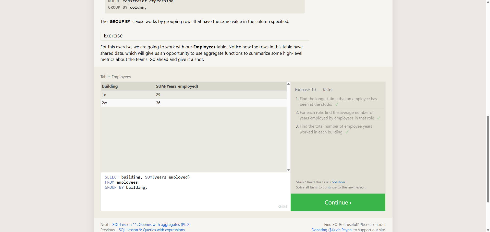

# TF-8 Advanced SQL - 5-Count Me In

**Course:** Cyber Security Analyst - Technical Fundamentals  
**Category:** Advanced SQL  
**Sprint status:** Completed  
**Target / Scope:** SQLBolt Lesson 10 - Queries with aggregates (Pt. 1)  
**Date:** 25 July 2026

---

## Task

This exercise completed SQLBolt Lesson 10. The goal was to use aggregate functions such as `MAX`, `AVG`, and `SUM` to summarize multiple table rows into metrics.

---

## What I Did

1. Opened SQLBolt Lesson 10 in the browser.
2. Read the explanation for aggregate functions and `GROUP BY`.
3. Solved the three query tasks in the lesson.
4. Verified that SQLBolt marked all three tasks as completed.

---

## Queries Used

### Task 1

```sql
SELECT MAX(years_employed)
FROM employees;
```

### Task 2

```sql
SELECT role, AVG(years_employed)
FROM employees
GROUP BY role;
```

### Task 3

```sql
SELECT building, SUM(years_employed)
FROM employees
GROUP BY building;
```

---

## Evidence



The screenshot shows SQLBolt Lesson 10 with all three task checkmarks visible. The query field shows the third query, calculating `SUM(years_employed)` per `building`.

---

## Findings

| Finding | Evidence | Interpretation |
|---|---|---|
| Lesson 10 was completed | All three task checkmarks are visible | The SQLBolt tasks were accepted |
| Aggregates were used | Queries use `MAX`, `AVG`, and `SUM` | Multiple rows were summarized into metrics |
| Grouping was used | Query field shows `GROUP BY building` | The total was calculated separately per building |

---

## Security Relevance

Aggregate functions are important for security analysis because they condense many individual events into metrics. Common examples include findings by severity, totals per asset group, or average values per team.

---

## Reviewer-Readable Result

| Field | Entry |
|---|---|
| Lab scope | SQLBolt Lesson 10 |
| Tool or method | Browser-based SQL exercise |
| Key observation | Aggregate functions summarize multiple rows into metrics |
| Final evidence | Screenshot with all three SQLBolt checkmarks |
| Security lesson | Aggregation supports reporting and trend analysis |
| Redactions | No credentials, cookies, tokens, or private data included |

---

## Short Explanation

This task shows how SQL can summarize many rows into meaningful metrics. With `GROUP BY`, those metrics are calculated separately for each group.