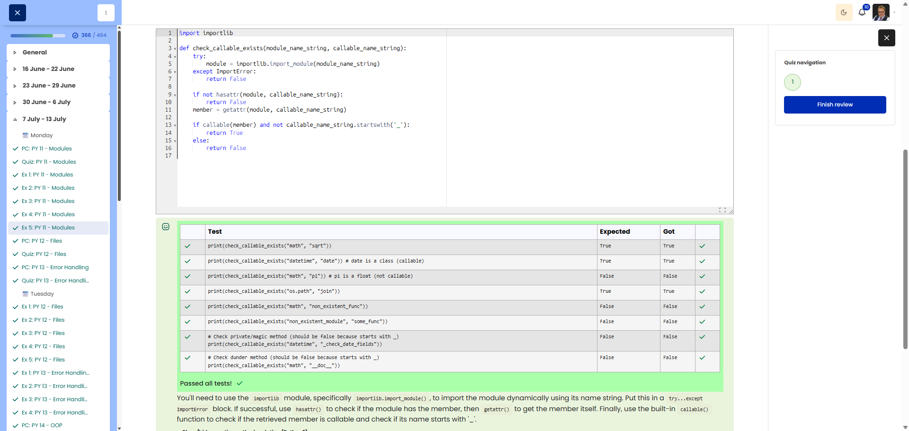

# PY 11 - Exercise 5: Callable

## Task

This exercise covered Python modules. The goal was to import the right standard-library module and implement the requested function so that all provided tests pass.

## Execution Environment

- Browser: Cybersteps / Moodle CodeRunner
- Language: Python 3
- Module 1: no TryHackMe

## Approach

1. The function requirements and tests were reviewed.
2. The solution was implemented in Python and checked against the visible test cases.
3. The passing test run was documented with a screenshot.

## Code Used

```python
import importlib

def check_callable_exists(module_name_string, callable_name_string):
    try:
        module = importlib.import_module(module_name_string)
    except ImportError:
        return False
    if not hasattr(module, callable_name_string):
        return False
    member = getattr(module, callable_name_string)
    return callable(member) and not callable_name_string.startswith("_")
```

## Result

All visible tests passed successfully. The screenshot shows the green Passed all tests! or Correct result.

## Evidence



## Evidence Assessment

The screenshot is sufficient evidence because it shows the passing test run, completed platform task, or relevant Git/GitHub state.

## Practical Value

Standard-library modules avoid unnecessary custom code and are an important part of maintainable Python solutions.
