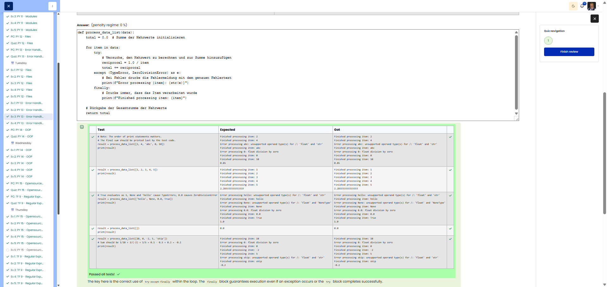

# PY 13 - Exercise 3: Process Data

## Task

This exercise covered Python error handling. The goal was to catch expected exceptions with 	ry/xcept and return predictable results.

## Execution Environment

- Browser: Cybersteps / Moodle CodeRunner
- Language: Python 3
- Module 1: no TryHackMe

## Approach

1. The function requirements and tests were reviewed.
2. The solution was implemented in Python and checked against the visible test cases.
3. The passing test run was documented with a screenshot.

## Code Used

```python
def process_data_list(data):
    total = 0.0
    for item in data:
        try:
            total += 1.0 / item
        except (TypeError, ZeroDivisionError) as e:
            print(f"Error processing {item}: {str(e)}")
        finally:
            print(f"Finished processing item: {item}")
    return total
```

## Result

All visible tests passed successfully. The screenshot shows the green Passed all tests! or Correct result.

## Evidence



## Evidence Assessment

The screenshot is sufficient evidence because it shows the passing test run, completed platform task, or relevant Git/GitHub state.

## Practical Value

Error handling makes programs more robust and predictable, especially when inputs, files, or external data sources can be invalid.
