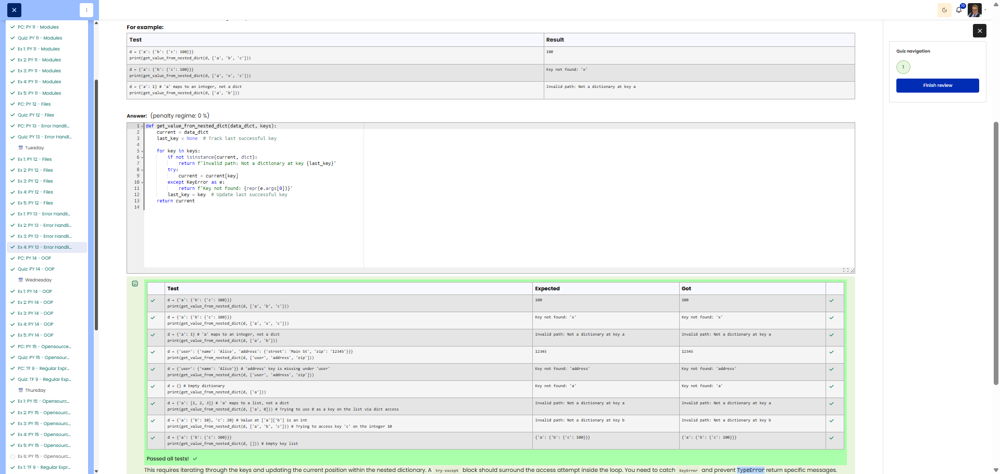

# PY 13 - Exercise 4: Nested Dict

## Task

This exercise covered Python error handling. The goal was to catch expected exceptions with 	ry/xcept and return predictable results.

## Execution Environment

- Browser: Cybersteps / Moodle CodeRunner
- Language: Python 3
- Module 1: no TryHackMe

## Approach

1. The function requirements and tests were reviewed.
2. The solution was implemented in Python and checked against the visible test cases.
3. The passing test run was documented with a screenshot.

## Code Used

```python
def get_value_from_nested_dict(data_dict, keys):
    current = data_dict
    last_key = None
    for key in keys:
        if not isinstance(current, dict):
            return f"Invalid path: Not a dictionary at key {last_key}"
        try:
            current = current[key]
        except KeyError as e:
            return f"Key not found: {repr(e.args[0])}"
        last_key = key
    return current
```

## Result

All visible tests passed successfully. The screenshot shows the green Passed all tests! or Correct result.

## Evidence



## Evidence Assessment

The screenshot is sufficient evidence because it shows the passing test run, completed platform task, or relevant Git/GitHub state.

## Practical Value

Error handling makes programs more robust and predictable, especially when inputs, files, or external data sources can be invalid.
