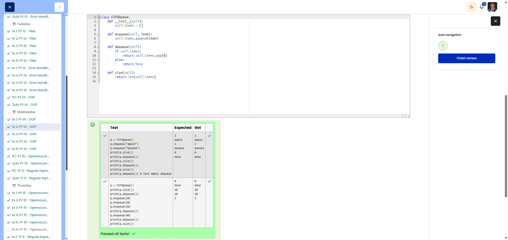

# PY 14 - Exercise 2: FIFO Queue

## Task

This exercise covered object-oriented programming in Python. The goal was to use classes, methods, attributes, and inheritance correctly.

## Execution Environment

- Browser: Cybersteps / Moodle CodeRunner
- Language: Python 3
- Module 1: no TryHackMe

## Approach

1. The function requirements and tests were reviewed.
2. The solution was implemented in Python and checked against the visible test cases.
3. The passing test run was documented with a screenshot.

## Code Used

```python
class FIFOQueue:
    def __init__(self):
        self.items = []

    def enqueue(self, item):
        self.items.append(item)

    def dequeue(self):
        if self.items:
            return self.items.pop(0)
        return None

    def size(self):
        return len(self.items)
```

## Result

All visible tests passed successfully. The screenshot shows the green Passed all tests! or Correct result.

## Evidence



## Evidence Assessment

The screenshot is sufficient evidence because it shows the passing test run, completed platform task, or relevant Git/GitHub state.

## Practical Value

OOP helps structure data and behavior clearly, which matters as programs grow or multiple objects follow the same rules.
