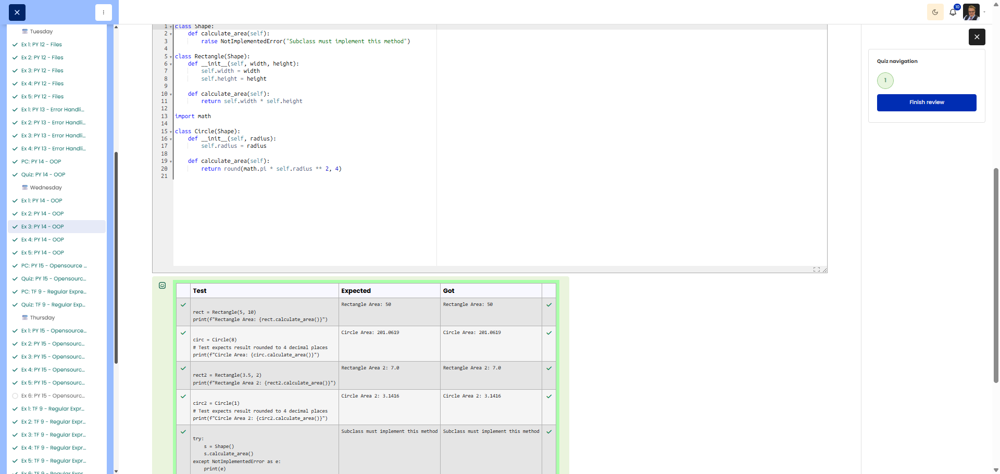

# PY 14 - Exercise 3: Shape Inheritance

## Task

This exercise covered object-oriented programming in Python. The goal was to use classes, methods, attributes, and inheritance correctly.

## Execution Environment

- Browser: Cybersteps / Moodle CodeRunner
- Language: Python 3
- Module 1: no TryHackMe

## Approach

1. The function requirements and tests were reviewed.
2. The solution was implemented in Python and checked against the visible test cases.
3. The passing test run was documented with a screenshot.

## Code Used

```python
import math
class Shape:
    def calculate_area(self):
        raise NotImplementedError("Subclass must implement this method")

class Rectangle(Shape):
    def __init__(self, width, height):
        self.width = width
        self.height = height
    def calculate_area(self):
        return self.width * self.height

class Circle(Shape):
    def __init__(self, radius):
        self.radius = radius
    def calculate_area(self):
        return round(math.pi * self.radius ** 2, 4)
```

## Result

All visible tests passed successfully. The screenshot shows the green Passed all tests! or Correct result.

## Evidence



## Evidence Assessment

The screenshot is sufficient evidence because it shows the passing test run, completed platform task, or relevant Git/GitHub state.

## Practical Value

OOP helps structure data and behavior clearly, which matters as programs grow or multiple objects follow the same rules.


