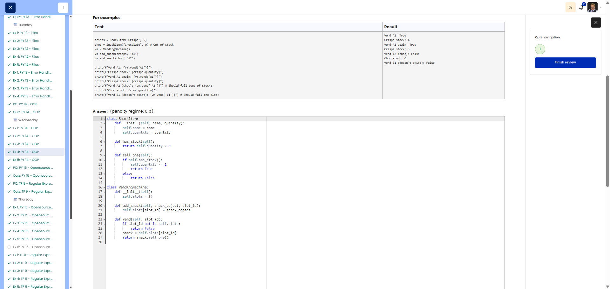
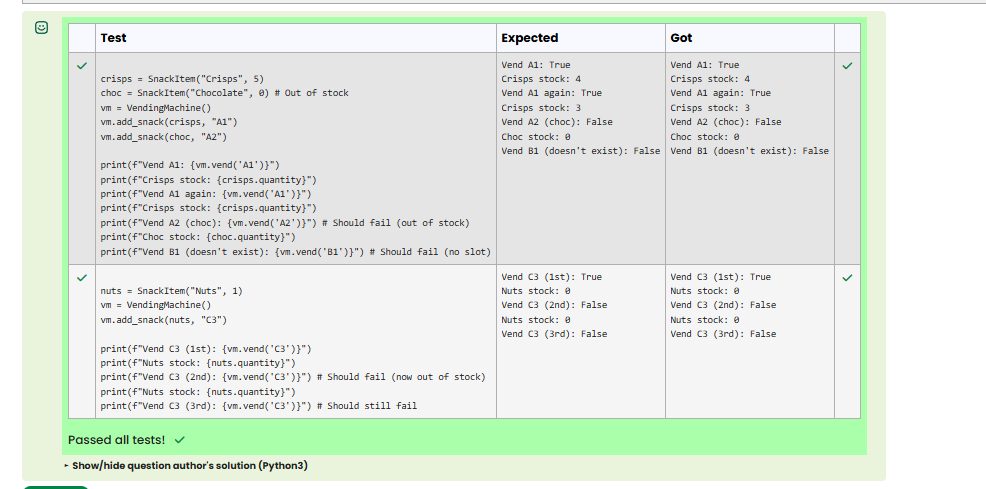

# PY 14 - Exercise 4: Vending Machine

## Task

This exercise covered object-oriented programming in Python. The goal was to use classes, methods, attributes, and inheritance correctly.

## Execution Environment

- Browser: Cybersteps / Moodle CodeRunner
- Language: Python 3
- Module 1: no TryHackMe

## Approach

1. The function requirements and tests were reviewed.
2. The solution was implemented in Python and checked against the visible test cases.
3. The passing test run was documented with a screenshot.

## Code Used

```python
class SnackItem:
    def __init__(self, name, quantity):
        self.name = name
        self.quantity = quantity
    def has_stock(self):
        return self.quantity > 0
    def sell_one(self):
        if self.has_stock():
            self.quantity -= 1
            return True
        return False

class VendingMachine:
    def __init__(self):
        self.slots = {}
    def add_snack(self, snack_object, slot_id):
        self.slots[slot_id] = snack_object
    def vend(self, slot_id):
        if slot_id not in self.slots:
            return False
        return self.slots[slot_id].sell_one()
```

## Result

All visible tests passed successfully. The screenshot shows the green Passed all tests! or Correct result.

## Evidence





## Evidence Assessment

The screenshot is sufficient evidence because it shows the passing test run, completed platform task, or relevant Git/GitHub state.

## Practical Value

OOP helps structure data and behavior clearly, which matters as programs grow or multiple objects follow the same rules.
