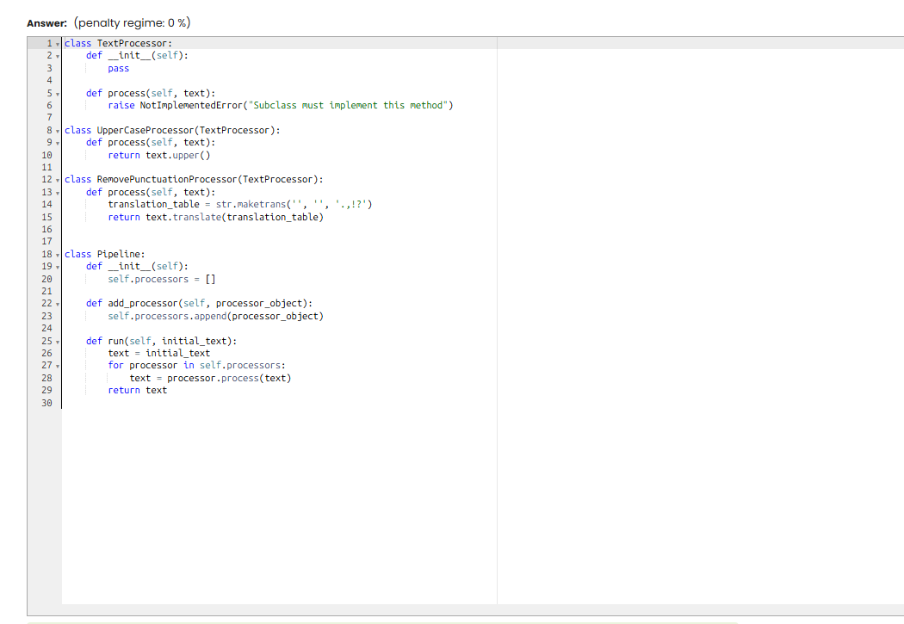
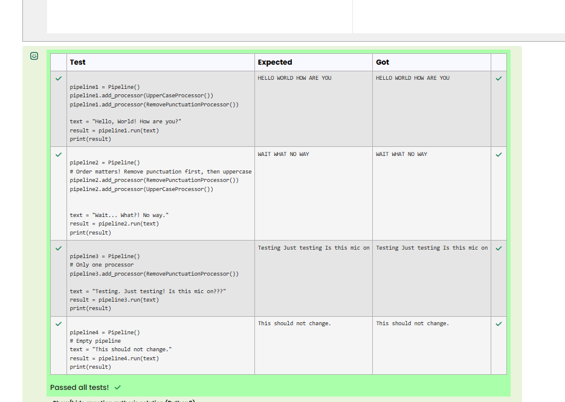

# PY 14 - Exercise 5: Text Pipeline

## Task

This exercise covered object-oriented programming in Python. The goal was to use classes, methods, attributes, and inheritance correctly.

## Execution Environment

- Browser: Cybersteps / Moodle CodeRunner
- Language: Python 3
- Module 1: no TryHackMe

## Approach

1. The function requirements and tests were reviewed.
2. The solution was implemented in Python and checked against the visible test cases.
3. The passing test run was documented with a screenshot.

## Code Used

```python
class TextProcessor:
    def process(self, text):
        raise NotImplementedError("Subclass must implement this method")

class UpperCaseProcessor(TextProcessor):
    def process(self, text):
        return text.upper()

class RemovePunctuationProcessor(TextProcessor):
    def process(self, text):
        return text.translate(str.maketrans("", "", ".,!?"))

class Pipeline:
    def __init__(self):
        self.processors = []
    def add_processor(self, processor_object):
        self.processors.append(processor_object)
    def run(self, initial_text):
        text = initial_text
        for processor in self.processors:
            text = processor.process(text)
        return text
```

## Result

All visible tests passed successfully. The screenshot shows the green Passed all tests! or Correct result.

## Evidence





## Evidence Assessment

The screenshot is sufficient evidence because it shows the passing test run, completed platform task, or relevant Git/GitHub state.

## Practical Value

OOP helps structure data and behavior clearly, which matters as programs grow or multiple objects follow the same rules.
