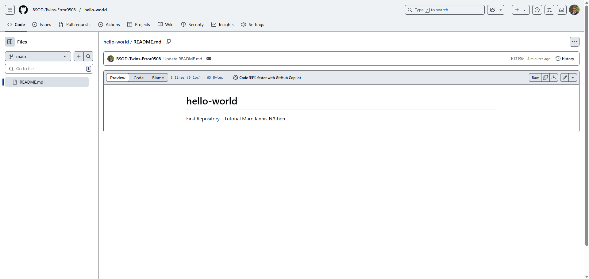

# PY 15 - Exercise 3: Open Source Explorer

## Task

This exercise covered open source and Git. The goal was to practice GitHub, Git, or contribution workflows and document the result.

## Execution Environment

- Browser/terminal: GitHub, Git, or Learn Git Branching depending on the exercise
- Course area: PY 15 - Opensource and Git
- Module 1: no TryHackMe

## Approach

1. The requested GitHub or Git workflow was followed or researched.
2. The relevant answers, commands, or results were documented.
3. Available screenshots were linked and assessed as evidence.

## Answers and Results Used

**Question 1:** Preferred method for code changes: GitHub Pull Request. Contributors should run tests and add relevant tests for bug fixes or features.

**Question 2:** Issue `#7152` - `builtin_str(method) incorrectly converts binary method names`. The issue describes that `builtin_str(method)` in `requests/models.py` mishandles binary method names and should decode bytes into strings correctly.

**Question 3:** Pull Request `#6104` - `ValueError when calling requests.get on Windows systems.` The PR addresses a Windows-specific `ValueError` and changes files including `utils.py`.

## Result

The required written answers are documented. The available screenshot is only general GitHub context; it is not direct evidence of the selected issue or pull request.

## Evidence

## Evidence Assessment

The written answers are complete. The screenshot only supports the general GitHub context and does not replace direct issue or pull request evidence.

## Practical Value

Git and open-source skills are central for collaboration, code history, reviews, and traceable changes in professional projects.
