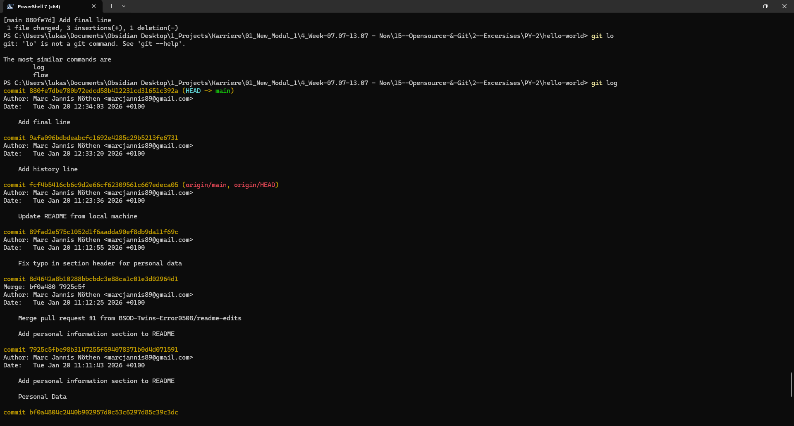
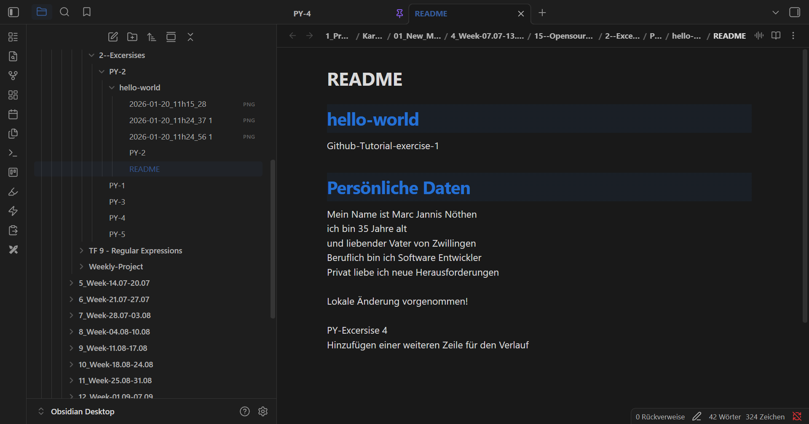

# PY 15 - Exercise 4: Time Traveler

## Task

This exercise covered open source and Git. The goal was to practice GitHub, Git, or contribution workflows and document the result.

## Execution Environment

- Browser/terminal: GitHub, Git, or Learn Git Branching depending on the exercise
- Course area: PY 15 - Opensource and Git
- Module 1: no TryHackMe

## Approach

1. The requested GitHub or Git workflow was followed or researched.
2. The relevant answers, commands, or results were documented.
3. Available screenshots were linked and assessed as evidence.

## Answers and Results Used

Selected commit:

`9afa096bdbdeabcfc1692e4285c29b5213fe6731`

The commit has the message `Add history line` and appears before the later `Add final line` commit.

## Result

The documented Git/GitHub steps are traceable. The available screenshots show the relevant working state or result.

## Evidence

## Evidence Assessment

The screenshot is sufficient evidence because it shows the passing test run, completed platform task, or relevant Git/GitHub state.

## Practical Value

Git and open-source skills are central for collaboration, code history, reviews, and traceable changes in professional projects.
