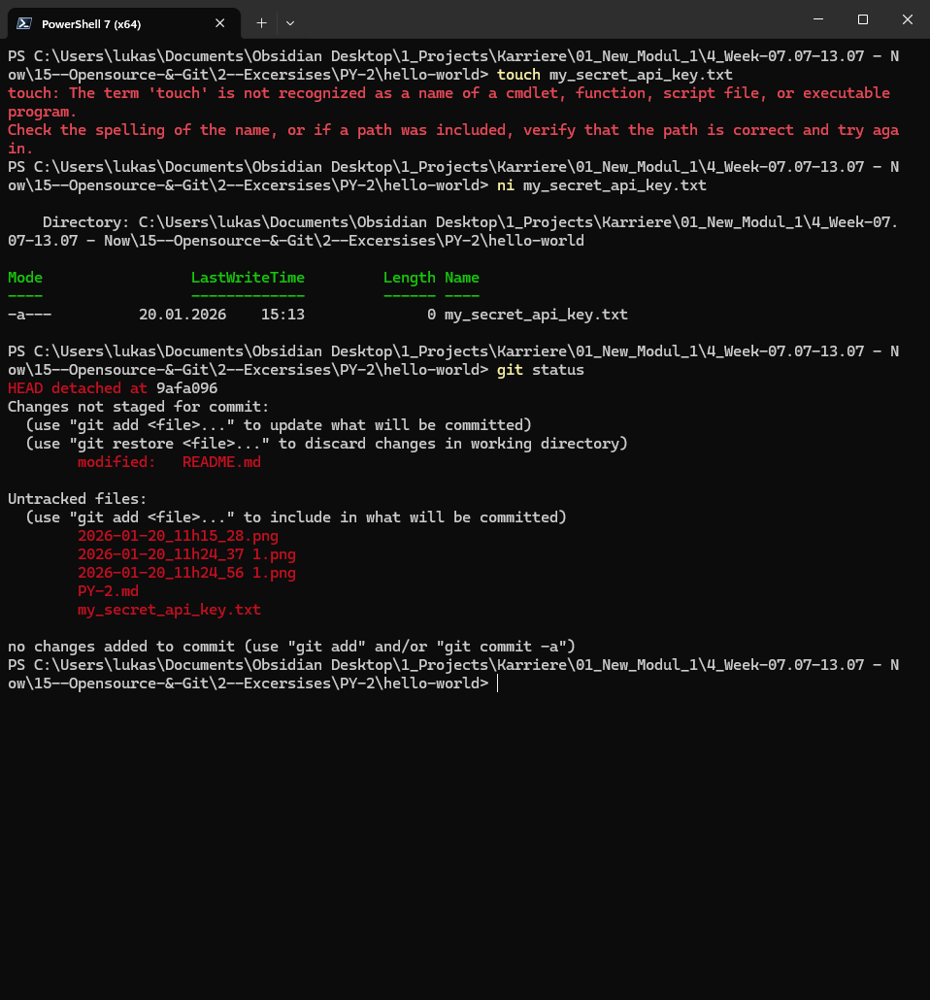
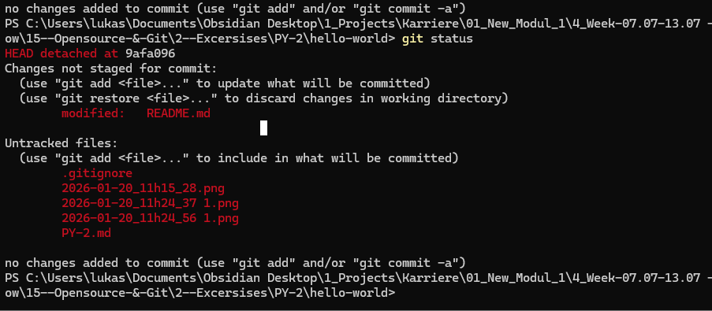
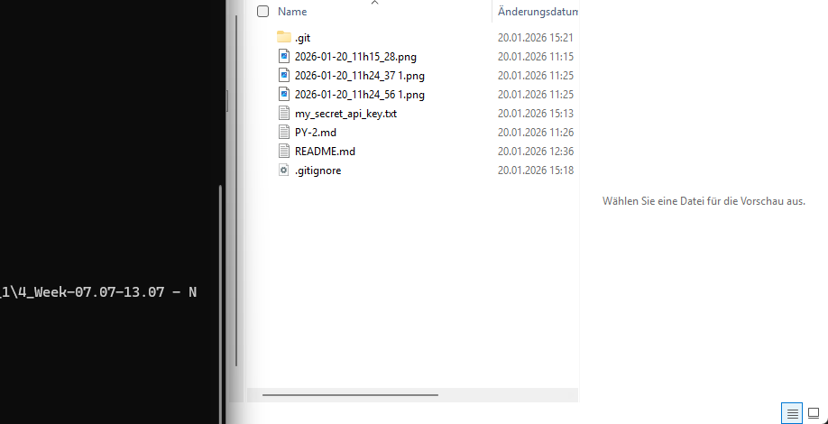

# PY 15 - Exercise 5: Selective Sight

## Task

This exercise covered open source and Git. The goal was to practice GitHub, Git, or contribution workflows and document the result.

## Execution Environment

- Browser/terminal: GitHub, Git, or Learn Git Branching depending on the exercise
- Course area: PY 15 - Opensource and Git
- Module 1: no TryHackMe

## Approach

1. The requested GitHub or Git workflow was followed or researched.
2. The relevant answers, commands, or results were documented.
3. Available screenshots were linked and assessed as evidence.

## Answers and Results Used

Ignored filename:

`my_secret_api_key.txt`

The `.gitignore` file belongs in the repository; the dummy secret file does not.

## Result

The documented Git/GitHub steps are traceable. The available screenshots show the relevant working state or result.

## Evidence

## Evidence Assessment

The screenshot is sufficient evidence because it shows the passing test run, completed platform task, or relevant Git/GitHub state.

## Practical Value

Git and open-source skills are central for collaboration, code history, reviews, and traceable changes in professional projects.
