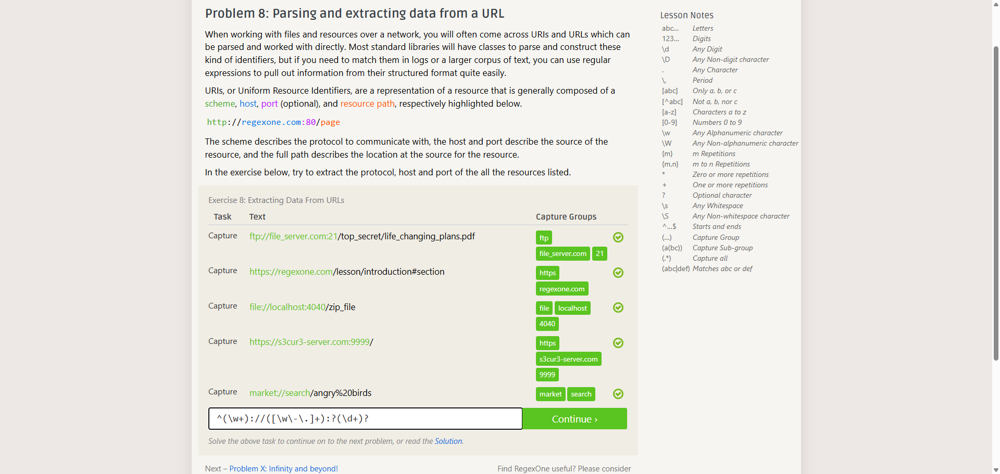

# TF 9 - Exercise 8: UR L

## Task

This exercise covered RegexOne regular expressions. The goal was to build a pattern that matches the required text or extracts the requested capture groups.

## Execution Environment

- Browser: RegexOne
- Course area: TF 9 - Regular Expressions
- Module 1: no TryHackMe

## Approach

1. The sample text and expected capture groups were reviewed.
2. The regular expression was adjusted until the required rows passed.
3. The successful result was documented with a screenshot.

## Regex Pattern Used

```regex
^(\w+)://([\w\-.]+):?(\d+)?
```

## Result

The RegexOne exercise was completed successfully. The screenshot shows the green matches or capture groups.

## Evidence



## Evidence Assessment

The screenshot is sufficient evidence because it shows the passing test run, completed platform task, or relevant Git/GitHub state.

## Practical Value

Regular expressions are useful for log analysis, validation, and quick extraction of structured information from text.
