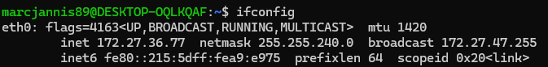

# NW 1 - Exercise 1: Network ID Card

## Task

The local IPv4 address of the active interface was identified and a ping command for checking google.com reachability was provided.

## Execution Environment

- Terminal: WSL/Linux
- Commands: ifconfig, ping

## Approach

1. ifconfig was executed.
2. The active eth0 interface was inspected.
3. The matching ping command was documented.

## Answers and Commands Used

Local IPv4 address: `172.27.36.77`

Check command:

```bash
ping -c 4 google.com
```

## Result

The exercise is completed; the screenshot shows the inet address of the active interface.

## Evidence



## Evidence Assessment

The screenshot is sufficient for the local IP address. The ping command is documented as text evidence.

## Practical Value

Networking fundamentals help make IP addresses, routing, latency, and provider infrastructure understandable in practice.
