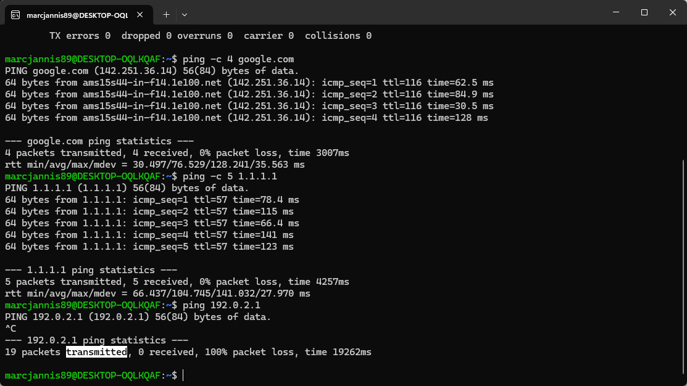

# NW 1 - Exercise 2: Whois There

## Task

Connectivity to 1.1.1.1 was tested, Whois information was reviewed, and the behavior difference to a non-routable documentation address was described.

## Execution Environment

- Terminal: WSL/Linux
- Commands: ping -c 5 1.1.1.1, ping 192.0.2.1

## Approach

1. 1.1.1.1 was pinged successfully.
2. A Whois lookup for 1.1.1.1 was reviewed.
3. 192.0.2.1 was pinged and stopped with Ctrl+C after no replies.

## Answers Used

Organization: `APNIC Research and Development`.

Observation: All 19 packets sent to `192.0.2.1` were lost. No connection was possible, and the request was stopped with Ctrl+C.

## Result

The exercise is completed; the screenshot shows successful replies for 1.1.1.1 and 100 percent packet loss for 192.0.2.1.

## Evidence

## Evidence Assessment

The screenshot supports the ping comparison. The Whois answer is documented as text.

## Practical Value

Networking fundamentals help make IP addresses, routing, latency, and provider infrastructure understandable in practice.
