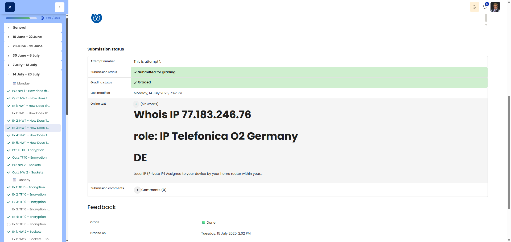

# NW 1 - Exercise 3: ISP Spotter

## Task

The public IP address was reviewed with Whois and compared with the local private IP address.

## Execution Environment

- Browser: Moodle submission / Whois result
- Network: home network / ISP

## Approach

1. The public IP address was identified.
2. A Whois lookup was reviewed for this IP address.
3. The local and public IP addresses were compared.

## Answers Used

Whois IP: `77.183.246.76`

Role/ISP: `IP Telefonica O2 Germany`

Country: `DE`

Local IP: a private IP address assigned to the device by the router inside the local network. It is not directly visible on the internet.

Public IP: an address assigned to the network by the Internet Service Provider. This is how the network appears externally.

## Result

The exercise is completed. The submission shows the Whois result and explains the difference between a local and a public IP address.

## Evidence

## Evidence Assessment

The screenshot shows the submitted answer for the Whois IP, ISP/role, and country. This is sufficient evidence for this exercise.

## Practical Value

Understanding the difference between local and public IP addresses is important for NAT, routing, ISP assignment, and external visibility on the internet.
