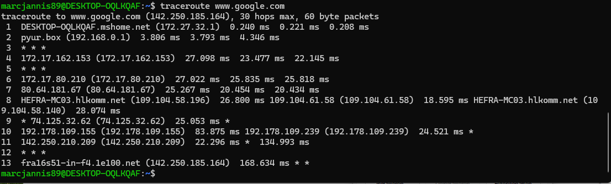

# NW 1 - Exercise 4: The Local Leap

## Task

A traceroute to Google was analyzed to understand local hops, ISP context, and latency differences.

## Execution Environment

- Terminal: WSL/Linux
- Command: traceroute www.google.com

## Approach

1. traceroute www.google.com was executed.
2. The first hops were identified.
3. Hop 1 and Hop 2 were interpreted in terms of local distance and ISP context.

## Answers Used

Hop 1: `DESKTOP-OQLKQAF.mshome.net (172.27.32.1)` at roughly `0.208-0.240 ms`.

Hop 2: `pyur.box (192.168.0.1)`, the local router/ISP handoff context.

The first hop is extremely fast because it is the local gateway on the same network. There is no long internet route, little routing overhead, and very short physical distance.

## Result

The exercise is completed; the screenshot shows at least the first 5 traceroute hops.

## Evidence

## Evidence Assessment

The screenshot sufficiently supports the traceroute output and the first-hop analysis.

## Practical Value

Networking fundamentals help make IP addresses, routing, latency, and provider infrastructure understandable in practice.
