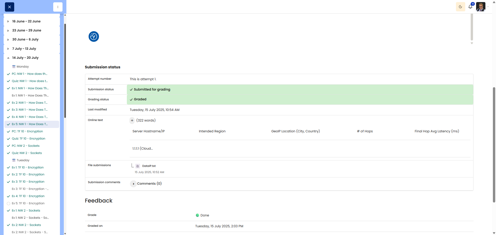

# NW 1 - Exercise 5: Hey Neighbours

## Task

Traceroutes to several global destination regions were compared to analyze distance, hop count, and latency.

## Execution Environment

- Terminal: WSL/Linux
- Tools: traceroute, GeoIP lookup
- Evidence file: `DataIP.txt`

## Approach

1. Several destination IP addresses in different world regions were selected.
2. A traceroute was run for each target.
3. The results were enriched with GeoIP data.
4. Hop count, target region, and latency were compared.

## Table and Analysis

| Server Hostname/IP | Intended Region | GeoIP Location (City, Country) | # of Hops | Final Hop Avg Latency |
|---|---|---|---:|---:|
| `1.1.1.1` Cloudflare | North America (USA/Canada) | Unknown / Anycast, no GeoIP match | 10 | ~24.11 ms |
| `129.250.4.1` NTT | East Asia (Japan) | United States (Generic) | 12+ no endpoint reply | N/A |
| `187.1.0.1` Claro Brazil | South America (Brazil) | Itaberaba, Bahia, Brazil | 23 | ~207.55 ms |
| `196.21.192.146` TENET | Southern Africa (South Africa) | East London, Eastern Cape, South Africa | 19 visible hops | ~209.67 ms last visible reply |

The collected traceroute data shows that latency generally increases with geographic distance. Cloudflare `1.1.1.1` stayed low at about 24 ms, while destinations in Brazil and South Africa were above 200 ms. This matches the longer physical distance and intercontinental routing.

Hop count, however, does not consistently increase with distance. Brazil had 23 hops, South Africa had 19 visible hops, and the route to NTT/Japan stopped replying before the final endpoint. This shows that hop count depends on topology, peering, routing policy, and filtered routers, not only on distance.

Larger latency jumps appear especially where traffic moves between major backbones or continents. The spikes in the Brazil route may indicate congestion, rate limiting, or suboptimal routing at specific intermediate hops.

## Result

The exercise is completed. The full raw traceroute data is included in the evidence file.

## Evidence

- [DataIP.txt](5-Hey-Neighbours-DataIP.txt)

## Evidence Assessment

The screenshot shows the Moodle submission with the table, analysis, and uploaded file. The `DataIP.txt` file additionally contains the full traceroute output and GeoIP results.

## Practical Value

Traceroute helps make routing paths, latency, hop count, peering, and possible bottlenecks understandable in practice.
