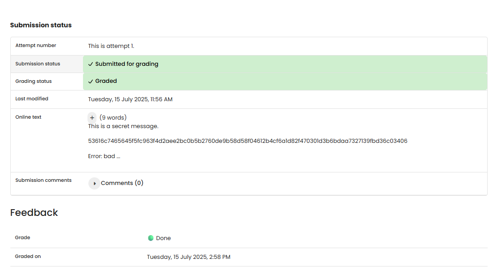

# TF 10 - Exercise 1: Key Keeper's Quest

## Task

AES encryption and decryption were tested with the correct and an incorrect key.

## Execution Environment

- Browser/Python 3
- Topic: encryption, hashing, or classic ciphers

## Approach

1. The exercise requirement was reviewed.
2. The provided solution was checked conceptually.
3. The result was documented.

## Answers Used

Decrypted message: `This is a secret message.`

Generated ciphertext: `53616c7465645f5fc963f4d2aee2bc0b5b2760de9b58d58f04612b4cf6a1d82f470301d3b6bdaa7327139fbd36c03406`

Wrong-key observation: `Error: bad decrypt`

## Result

The exercise is completed as a written answer. No screenshot was provided.

## Evidence

## Evidence

## Practical Value

Cryptography fundamentals are important for correctly understanding confidentiality, integrity, hashing, passwords, and classic attacks.

