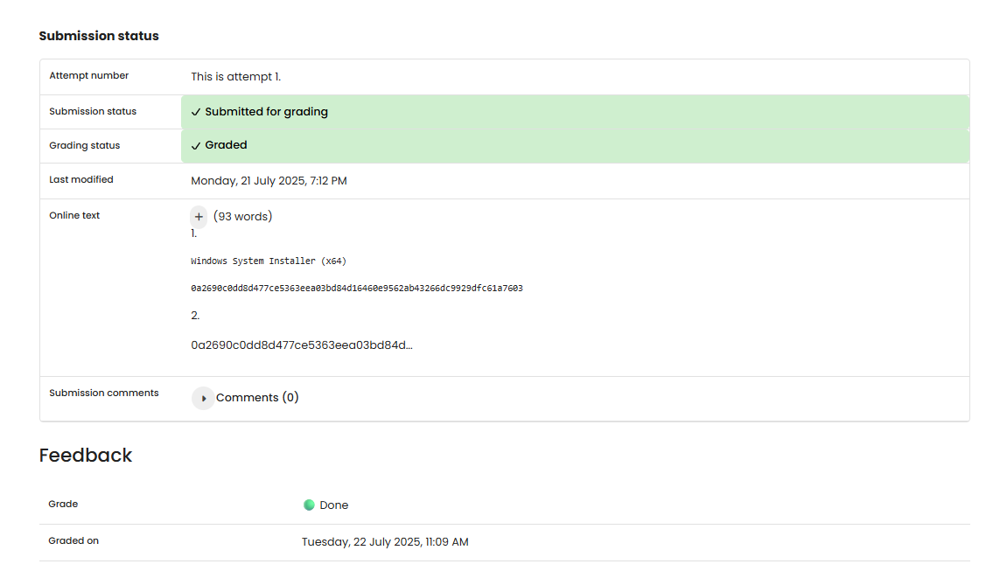

# TF 10 - Exercise 2: Hash Tag Youre It

## Task

The SHA-256 hash of a VS Code file was compared to the official hash, and a modified copy was hashed again.

## Execution Environment

- Browser/Python 3
- Topic: encryption, hashing, or classic ciphers

## Approach

1. The exercise requirement was reviewed.
2. The provided solution was checked conceptually.
3. The result was documented.

## Answers Used

File: `Windows System Installer (x64)`
Official SHA-256: `0a2690c0dd8d477ce5363eea03bd84d16460e9562ab43266dc9929dfc61a7603`
Calculated SHA-256: `0a2690c0dd8d477ce5363eea03bd84d16460e9562ab43266dc9929dfc61a7603`
Match: `Yes`
Tampered hash: `2d3a7a0543f662b6d4ae0a6ce9d0c70b325bf2fe4d94413e80f53324637c8018`

Hash functions create a digital fingerprint. Even a tiny file change completely changes the hash.

## Result

The exercise is completed as a written answer. No screenshot was provided.

## Evidence

## Evidence

## Practical Value

Cryptography fundamentals are important for correctly understanding confidentiality, integrity, hashing, passwords, and classic attacks.

