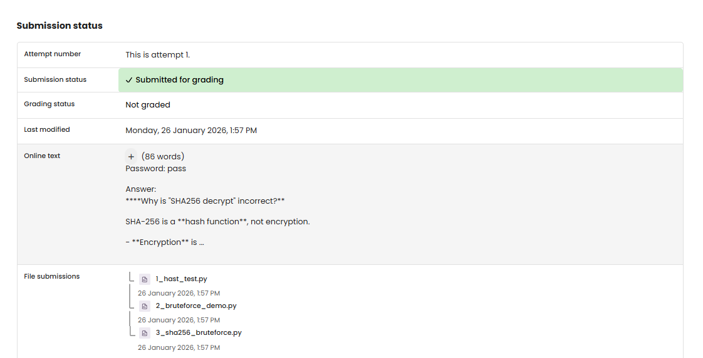

# TF 10 - Exercise 3: Password Puzzler

## Task

A short SHA-256 hash was brute-forced with Python, and the term SHA256 decrypt was explained.

## Execution Environment

- Browser/Python 3
- Topic: encryption, hashing, or classic ciphers

## Approach

1. The exercise requirement was reviewed.
2. The provided solution was checked conceptually.
3. The result was documented.

## Answers Used

Password: `pass`

SHA-256 is a hash function, not encryption. Online tools do not decrypt SHA-256; they perform hash lookup, hash cracking, or reverse lookup using precomputed databases.

## Result

The exercise is completed as a written answer. No screenshot was provided.

## Evidence

## Evidence

## Practical Value

Cryptography fundamentals are important for correctly understanding confidentiality, integrity, hashing, passwords, and classic attacks.

