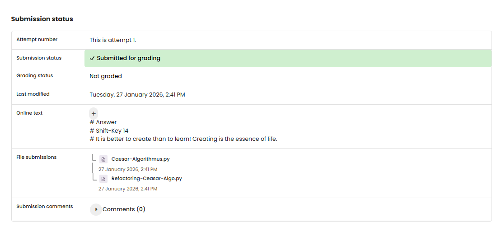

# TF 10 - Exercise 4: Caesar's Codebreaker

## Task

A Caesar cipher was decrypted by brute-forcing the shift with Python.

## Execution Environment

- Browser/Python 3
- Topic: encryption, hashing, or classic ciphers

## Approach

1. The exercise requirement was reviewed.
2. The provided solution was checked conceptually.
3. The result was documented.

## Answers Used

Shift key: `14`
Plaintext: `It is better to create than to learn! Creating is the essence of life.`

## Result

The exercise is completed as a written answer. No screenshot was provided.

## Evidence

## Evidence

## Practical Value

Cryptography fundamentals are important for correctly understanding confidentiality, integrity, hashing, passwords, and classic attacks.

