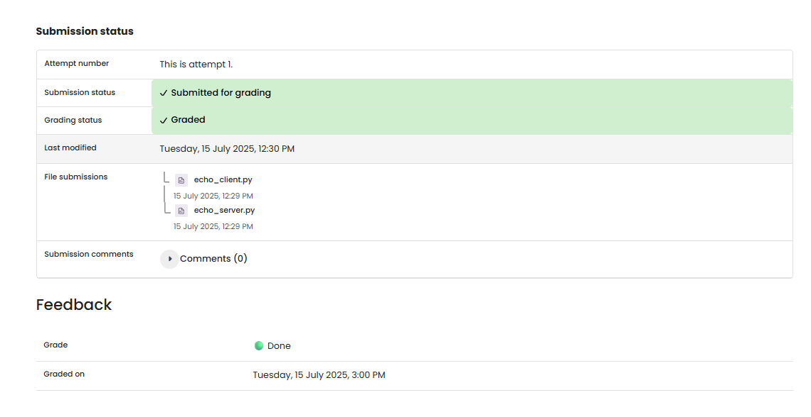

# NW2 Ex1 - Echo Chamber

## Task
Create a simple TCP echo server and a matching client. The server should send the received data back to the client unchanged.

## Execution Environment
- Language: Python
- Module: socket
- Host: local
- Port: 9999

## Approach
The server creates a TCP socket, binds it to a local port, waits for a client connection, and reads incoming bytes with `recv()`. For a correct echo solution, the server sends exactly these received bytes back with `conn.sendall(data)`.

## Code Used
The submission files are stored in this folder:

- `echo_server.py`
- `echo_client.py`

Correct echo core logic in the server:

```python
data = conn.recv(1024)
conn.sendall(data)
```

## Result
The server file has been corrected. It no longer returns a fixed response; it now sends back exactly the data received from the client.

## Evidence


## Evidence


## Practical Value
This task demonstrates the foundation of TCP communication: accepting a connection, receiving data, and sending data back through the same connection.

