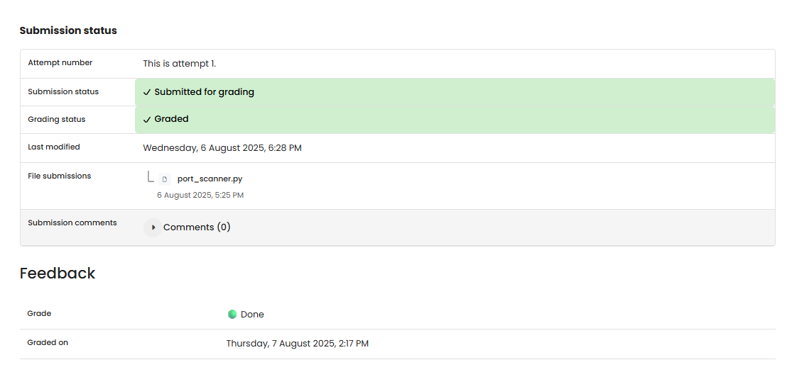

# NW 2 - Exercise 2: Port Knocking

## Task

A simple port scanner for 127.0.0.1 was created with Python sockets.

## Execution Environment

- Python 3
- Module: socket

## Approach

1. The provided Python file was reviewed.
2. The socket logic was compared with the exercise requirement.
3. The result and evidence limitation were documented.

## Approach Used

File: `port_scanner.py`

The scanner creates a new TCP socket per port, sets a short timeout, and reports successful connections as open ports.

## Result

The exercise is documented by provided files or text output. No runtime screenshot was provided.

## Evidence

## Evidence

## Practical Value

Socket programming demonstrates how clients, servers, ports, and simple protocols work together.

