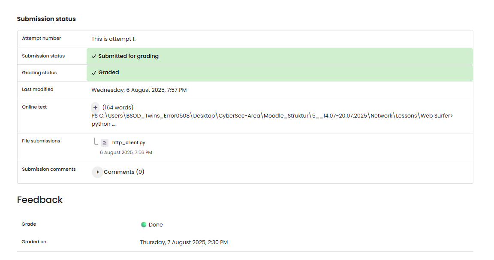

# NW 2 - Exercise 3: Web Surfer

## Task

An HTTP client was written with Python sockets and tested against example.com.

## Execution Environment

- Python 3
- Module: socket

## Approach

1. The provided Python file was reviewed.
2. The socket logic was compared with the exercise requirement.
3. The result and evidence limitation were documented.

## Approach Used

File: `http_client.py`

The connection to `23.192.228.80:80` was established. The response contained `HTTP/1.1 200 OK`, `Content-Type: text/html`, and the Example Domain HTML.

## Result

The exercise is documented by provided files or text output. No runtime screenshot was provided.

## Evidence

## Evidence

## Practical Value

Socket programming demonstrates how clients, servers, ports, and simple protocols work together.

