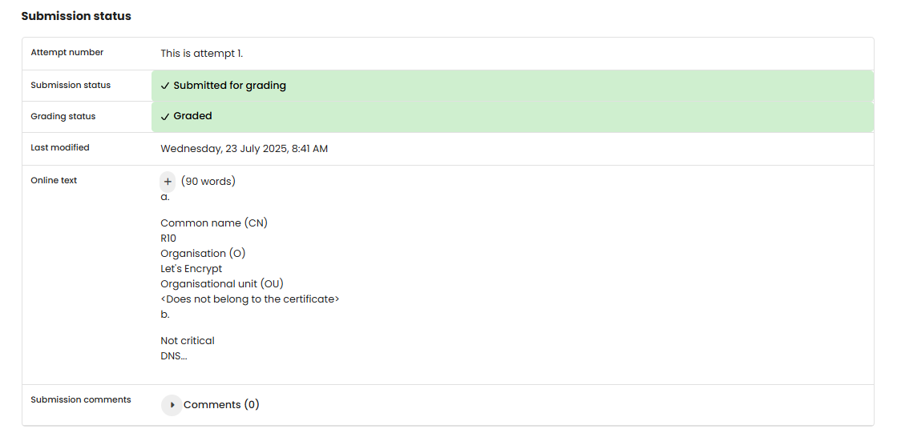

# TF 11 - Exercise 1: Certificate Snapshot

## Task

A Let's Encrypt certificate was inspected in the browser and the key fields were documented.

## Execution Environment

- Browser: certificate viewer
- Website: eff.org

## Approach

1. The certificate was opened in the browser.
2. Issuer, SANs, validity, and AIA were read.
3. The meaning of the fields was described.

## Answers Used

a. Issuer: Common Name `R10`, Organization `Let's Encrypt`, OU not present.

b. SAN: not critical; DNS names `*.eff.org` and `*.staging.eff.org`.

c. Validity: `27.06.25, 17:23:40 MESZ` to `25.09.25, 17:23:39 MESZ`. Let's Encrypt uses roughly 90 days for security, automation, and modern best practice.

d. AIA contains CA Issuers for the intermediate certificate and OCSP for status checking. CA Issuers URI: `http://r10.i.lencr.org/`.

## Result

The exercise is completed as a written answer. No browser screenshot was provided.

## Evidence

## Evidence

## Practical Value

Certificates and signatures are core building blocks for TLS trust, identity, integrity, and secure web communication.

