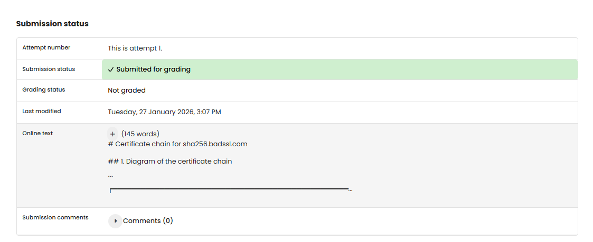

# TF 11 - Exercise 2: Root of All Trust

## Task

The certificate chain for sha256.badssl.com was documented as a trust chain.

## Execution Environment

- Browser: certificate path
- Website: sha256.badssl.com

## Approach

1. sha256.badssl.com was opened.
2. The certificate path was inspected.
3. Root, intermediate, and server certificate were ordered.

## Certificate Chain

```text
ISRG Root X1 (self-signed root CA)
  signs R13 (intermediate CA)
    signs *.badssl.com (server certificate)
```

Root subject: CN = ISRG Root X1, O = Internet Security Research Group, C = US; issuer is identical because it is self-signed.

Intermediate subject: CN = R13; issuer: CN = ISRG Root X1.

Server subject: CN = *.badssl.com; issuer: CN = R13.

Intermediate certificates connect server certificates to trusted root CAs while keeping root keys safer and delegating operational certificate issuance.

## Result

The exercise is completed as a diagram/written answer. No browser screenshot was provided.

## Evidence


## Evidence


## Practical Value

Certificates and signatures are core building blocks for TLS trust, identity, integrity, and secure web communication.

