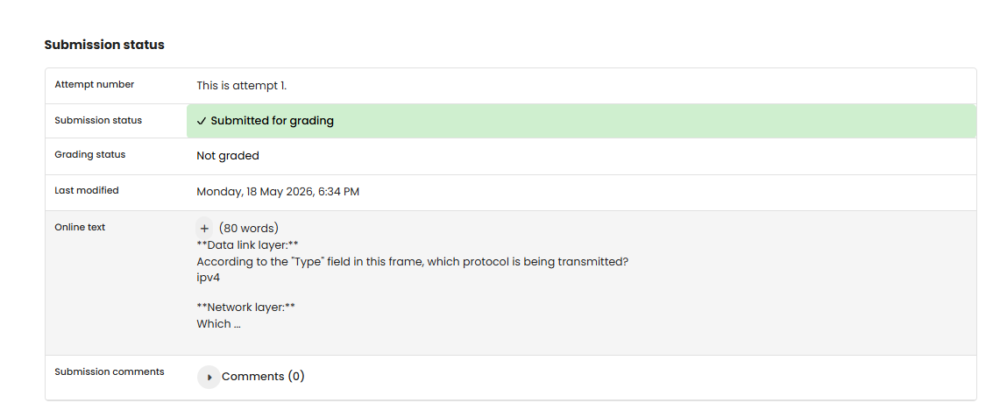

# NW 3 - Exercise 1: The Onion

## Task

An HTTP GET packet was analyzed in Wireshark using the 5-layer model.

## Execution Environment

- Wireshark
- Target traffic: HTTP GET

## Approach

1. HTTP traffic was filtered.
2. A GET packet was selected.
3. The relevant layers were read from the packet details.

## Answers Used

**Data link layer:** Type field transmits `IPv4`.

**Network layer:** Protocol `IP`; source IP `192.168.0.92`, destination IP `34.223.124.45`.

**Transport layer:** Protocol `TCP`; source port `65510`, destination port `80`.

**Application layer:** Protocol `HTTP`; request method `GET`, request URI `/`, request version `HTTP/1.1`.

## Result

The exercise is completed as a written answer. No Wireshark screenshot was provided.

## Evidence

## Evidence

## Practical Value

Wireshark analysis connects theory with real packets and makes visible which protocols operate at each layer.

