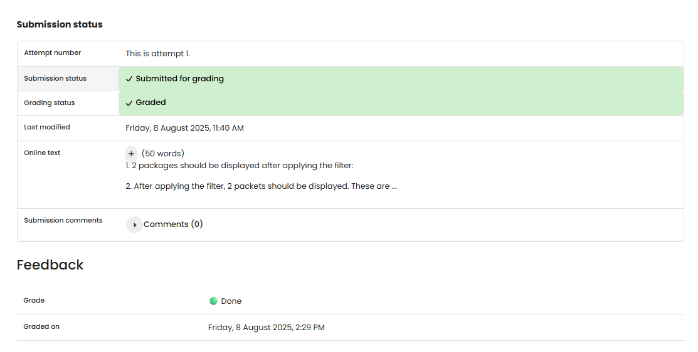

# NW 4 - Exercise 1: Aquarium Filter

## Task

More complex Wireshark display filters were applied to a sample capture and packet counts were documented.

## Execution Environment

- Wireshark
- Capture: http.cap

## Approach

1. The capture was opened in Wireshark.
2. The requested display filters were applied.
3. The visible packet counts were recorded.

## Answers Used

1. HTTP GET requests: `2` packets.
2. IP `145.254.168.237` but no HTTP port-80 traffic: `2` packets.
3. ARP requests or DNS requests: `1` packet.
4. HTTP packets with `frame.len > 400`: `3` packets.

## Result

The exercise is completed as a written answer. No Wireshark screenshot was provided.

## Evidence

## Evidence

## Practical Value

Wireshark analysis connects theory with real packets and makes visible which protocols operate at each layer.

