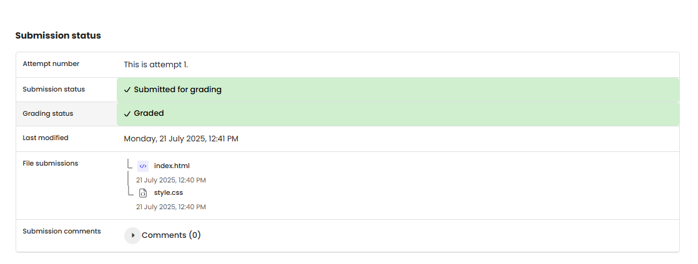

# WEB 1 - Exercise 1: Hello, Web! (PR)

## Task
Create a first HTML page as the foundation for later web exercises.

## Execution Environment
- Browser: local HTML file
- Files: `web1-ex1/index.html`, `web1-ex1/style.css`
- Technologies: HTML, CSS

## Approach
1. Created a basic HTML structure with `<!DOCTYPE html>`, `html`, `head`, and `body`.
2. Linked a CSS file.
3. Added a heading and paragraph as first visible content.

## Code Used / Files Used
- `web1-ex1/index.html`
- `web1-ex1/style.css`

## Result
The submitted files document a first local HTML/CSS page. No screenshot was provided for this specific task.

## Evidence

## Evidence

## Practical Value
Basic HTML structure and CSS linking are the foundation of web development.

