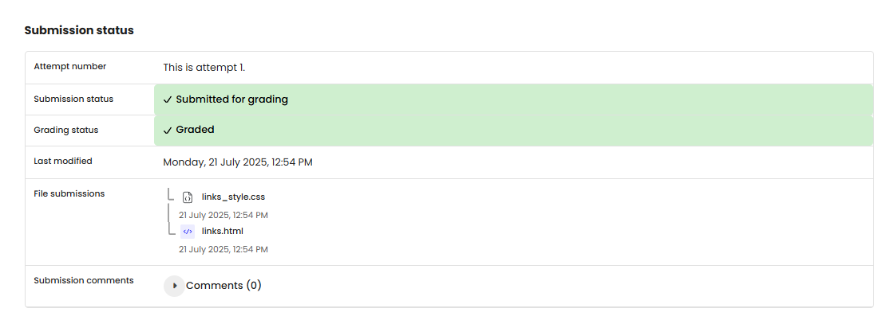

# WEB 1 - Exercise 2: Linking Around (PR)

## Task
Create a simple link collection or navigation with multiple links.

## Execution Environment
- Browser: local HTML file
- Files: `web1-ex2/links.html`, `web1-ex2/links_style.css`
- Technologies: HTML, CSS

## Approach
1. Created an HTML page with a heading.
2. Added an unordered list with several links.
3. Styled the links through a separate CSS file.

## Code Used / Files Used
- `web1-ex2/links.html`
- `web1-ex2/links_style.css`

## Result
The link collection exists as a local HTML/CSS submission. No separate screenshot was provided.

## Evidence

## Evidence

## Practical Value
Links and navigation structures are central building blocks of websites.

