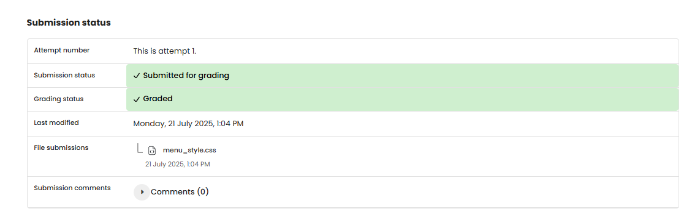

# WEB 1 - Exercise 3: Elementary Fix

## Task
Fix a broken CSS file for a horizontal navigation menu.

## Execution Environment
- Browser DevTools / local browser
- File: `web1-ex3/menu_style.css`
- Technology: CSS

## Approach
1. Reviewed the CSS rules for navigation, list items, and links.
2. Identified unsuitable values for bullets, layout, and contrast.
3. Saved the corrected file as the submission artifact.

## Code Used / Files Used
- `web1-ex3/menu_style.css`

## Result
The corrected CSS file is present. No screenshot of the horizontal menu was provided.

## Evidence

## Evidence

## Practical Value
This task practices CSS debugging, selectors, and layout correction.

