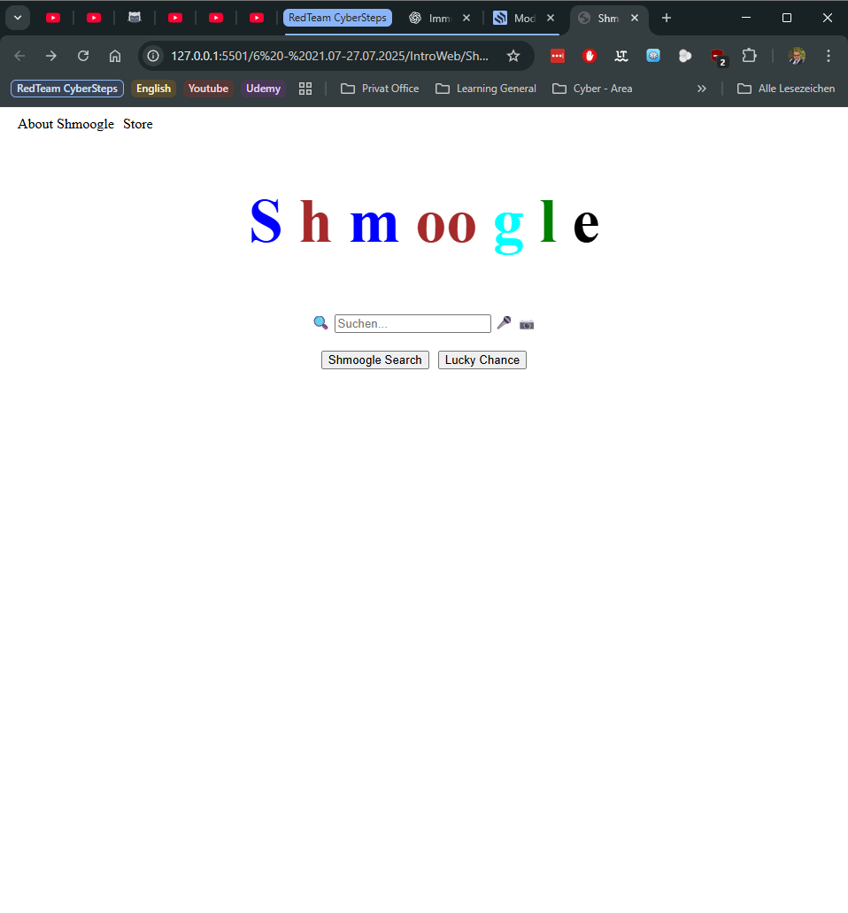

# WEB 1 - Exercise 4: Shmoogle

## Task
Create a local search-engine-style page named `Shmoogle` with a search field, buttons, and a JavaScript alert.

## Execution Environment
- Browser: local HTML file
- Files: `web1-ex4/Shmoogle.html`, `web1-ex4/style.css`
- Technologies: HTML, CSS, JavaScript

## Approach
1. Created a Shmoogle page with colored logo, links, search field, and buttons.
2. Added JavaScript event listeners for clicks.
3. Triggered an alert with `You got Shmoogled!`.

## Code Used / Files Used
- `web1-ex4/Shmoogle.html`
- `web1-ex4/style.css`

## Result
The Shmoogle page is implemented and supported by screenshot evidence.

## Evidence

## Evidence Assessment
The screenshot shows the local Shmoogle page in the browser. The alert itself is not visible in the screenshot, but the JavaScript logic is present in the HTML file.

## Practical Value
This task combines HTML structure, CSS layout, and first JavaScript interaction.
