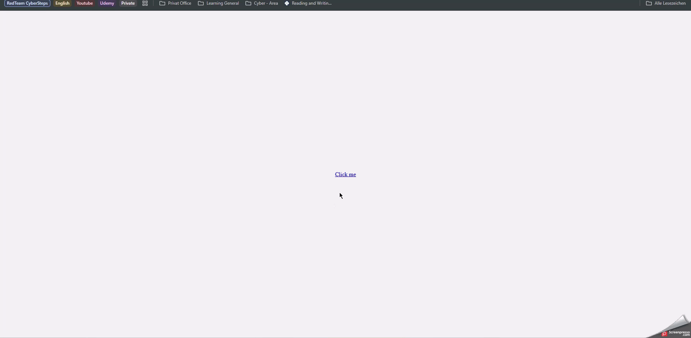

# WEB 1 - Exercise 5: Hint Deception

## Task
Create a link that displays a tooltip on hover and navigates to a different target when clicked.

## Execution Environment
- Browser: local HTML file
- Files: `web1-ex5/index.html`, `web1-ex5/style.css`
- Technologies: HTML, CSS, JavaScript

## Approach
1. Created a visible link with a CSS tooltip.
2. Styled the tooltip so that a different URL appears on hover.
3. Configured the click target separately and added an alert.

## Code Used / Files Used
- `web1-ex5/index.html`
- `web1-ex5/style.css`

## Result
The hover/click demo is implemented and supported by GIF evidence.

## Evidence

## Evidence Assessment
The GIF shows the interaction. The HTML and CSS files document the implementation.

## Practical Value
This task demonstrates how UI hints can influence user perception and why link targets should be checked carefully.
