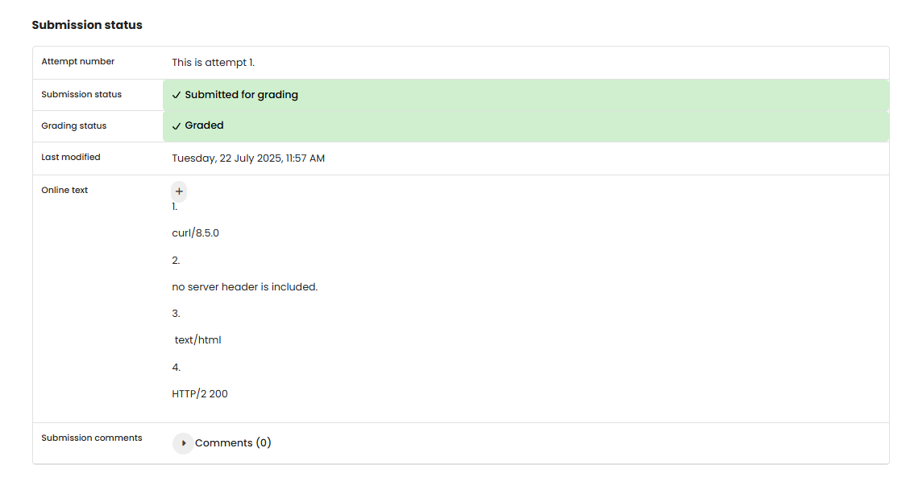

# NW 5 - Exercise 1: Header Honcho

## Task
Use `curl` to fetch a webpage and inspect request/response headers.

## Execution Environment
- Tool: curl
- Target: `https://example.com`
- Protocol: HTTP/2 over HTTPS

## Approach
1. Ran a verbose `curl` request.
2. Separated request headers from response headers.
3. Answered the four required questions from the output.

## Answers Used
1. User-Agent: `curl/8.5.0`
2. Server: no `Server` header included
3. Content-Type: `text/html`
4. Status: `HTTP/2 200`

## Result
The header questions were answered. No screenshot or full terminal output was provided.

## Evidence

## Evidence

## Practical Value
Header analysis helps understand clients, server responses, content types, and HTTP status codes.

