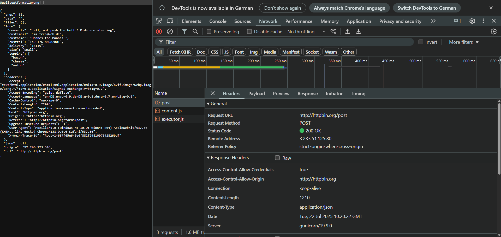
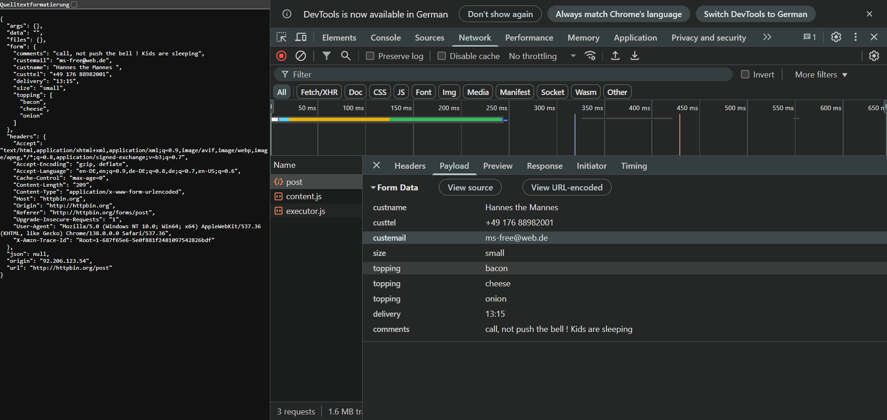
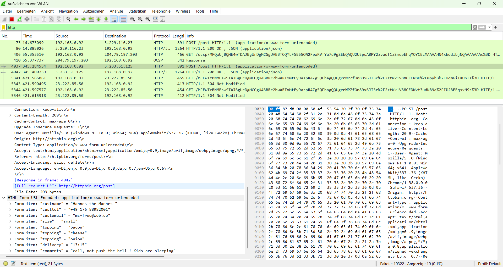

# NW 5 - Exercise 2: Formidable POST

## Task
Analyze an HTTP POST form submission in browser DevTools and Wireshark, focusing on headers and payload encoding.

## Execution Environment
- Browser: Chrome DevTools
- Analysis tool: Wireshark
- Target: `http://httpbin.org/post`
- Method: POST
- Content-Type: `application/x-www-form-urlencoded`

## Approach
1. Submitted the form at `http://httpbin.org/forms/post`.
2. Inspected the POST request in Chrome DevTools.
3. Reviewed the same request in Wireshark with an HTTP filter.
4. Compared form data and headers.

## Answers and Results Used
Form data:

```text
custname = Hannes the Mannes
custtel = +49 176 88982001
custemail = ms-free@web.de
size = small
topping = bacon
topping = cheese
topping = onion
delivery = 13:15
comments = call, not push the bell ! Kids are sleeping
```

If an additional `Delivery Tip` field existed, the URL-encoded payload would receive another key-value pair, for example `delivery_tip=...`.

## Result
The POST request was identified in DevTools and Wireshark. Headers, target URL, and form data are documented.

## Evidence






## Evidence Assessment
The screenshots show request method, target URL, payload/form data, and Wireshark packet view. This is strong evidence for the task.

## Practical Value
POST analysis is fundamental for web debugging, API understanding, and security analysis of form submissions.
