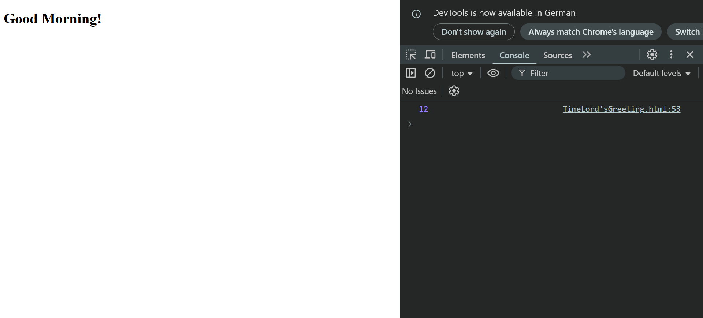

# WEB 2 - Exercise 1: Time Lord's Greeting (PR)

## Task
Create an HTML page with JavaScript that shows a greeting based on the time of day and logs it in the browser console.

## Execution Environment
- Browser: Chrome
- File: `web2-ex1/TimeLordsGreeting.html`
- Technologies: HTML, JavaScript

## Approach
1. Read the current hour with `new Date().getHours()`.
2. Used `if`/`else if`/`else` to select a greeting.
3. Displayed the greeting in the `<h1>` and logged the hour in the console.

## Code Used / Files Used
- `web2-ex1/TimeLordsGreeting.html`

## Result
The page shows `Good Morning!`; the console shows hour `12`.

## Evidence

## Evidence Assessment
The screenshot shows the dynamically set greeting and console output. The task text is stricter than the submitted file; this solution documents the actually supplied implementation.

## Practical Value
This task practices DOM access, conditions, and simple time-based UI logic.
