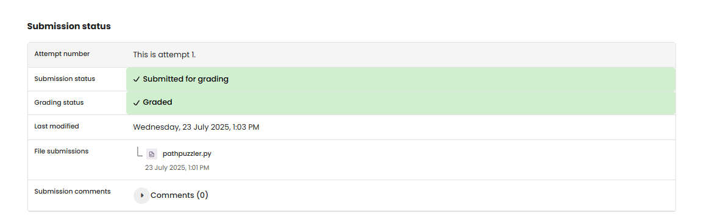

# WEB 3 - Exercise 1: Path Puzzler (PR)

## Task
Create a Flask application with several routes.

## Execution Environment
- Language: Python
- Framework: Flask
- File: `web3-ex1/pathpuzzler.py`

## Approach
1. Created a Flask app.
2. Implemented static routes for home, status, and info.
3. Added dynamic routes for greetings and calculations.

## Code Used / Files Used
- `web3-ex1/pathpuzzler.py`

## Result
The Flask routes are implemented in the submitted file. No runtime screenshot was provided.

## Evidence

## Evidence

## Practical Value
Flask routing is the foundation of server-side web applications and APIs.

