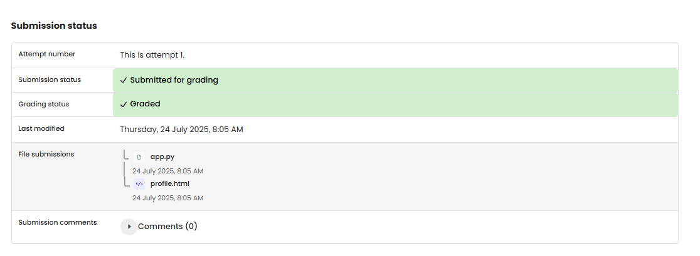

# WEB 3 - Exercise 2: Jinja Ninja

## Task
Create a Flask application that renders an HTML template with dynamic data.

## Execution Environment
- Language: Python
- Framework: Flask / Jinja2
- Files: `web3-ex2/app.py`, `web3-ex2/templates/profile.html`

## Approach
1. Created a Flask app with route `/user/<username>`.
2. Defined variables for programming language and hobbies.
3. Rendered `profile.html` with `render_template()` and passed the data to it.

## Code Used / Files Used
- `web3-ex2/app.py`
- `web3-ex2/templates/profile.html`

## Result
The Jinja template solution is present as Python file and template. No runtime screenshot was provided.

## Evidence

## Evidence

## Practical Value
Templates separate Python logic from HTML output and are central to server-side web development.

