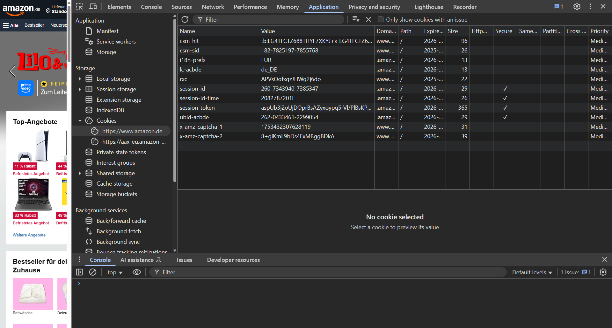
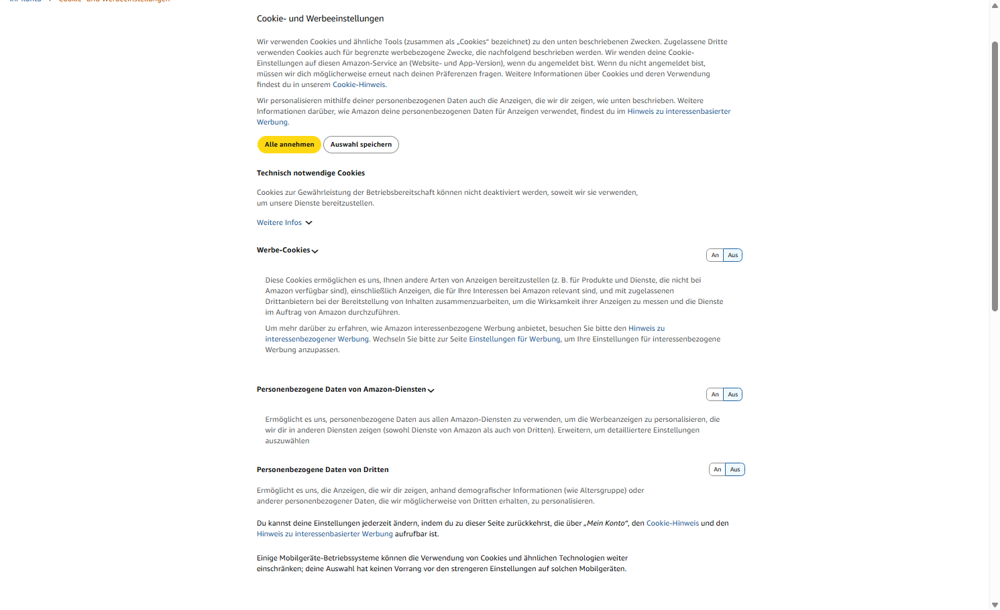
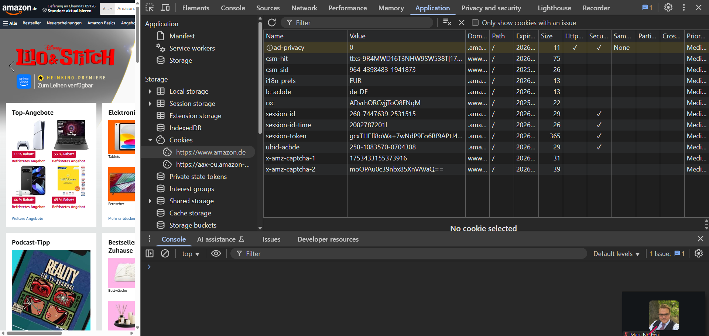

# WEB 4 - Exercise 1: Cookie Choices

## Task
Investigate how cookie consent settings affect which cookies are stored in the browser.

## Execution Environment
- Browser: Chrome
- DevTools: Application / Cookies
- Example site: Amazon.de
- Notes file: `web4-ex1/cybersteps-cookies.txt`

## Approach
1. Reviewed cookies before or during cookie selection in DevTools.
2. Opened cookie and advertising settings.
3. Reviewed the cookie state again after changing the selection.
4. Documented cookie names and legal context.

## Answers and Results Used
Observed cookies and values were recorded in `web4-ex1/cybersteps-cookies.txt`, including:

```text
session-id
ubid-acbde
session-token
ad-privacy = 0
```

Legal context:
In the EU, including Germany, GDPR and ePrivacy rules require informed consent for non-essential cookies such as advertising or tracking cookies. Essential cookies for security, login, or shopping baskets may be set without explicit consent when required for the requested service.

## Result
Cookie states and the effect of consent choices were documented through screenshots and notes.

## Evidence






## Evidence Assessment
The screenshots show DevTools cookie views and the cookie settings page. The notes file adds observed names and legal evaluation.

## Practical Value
Cookie analysis helps understand sessions, tracking, privacy, and consent mechanisms.
